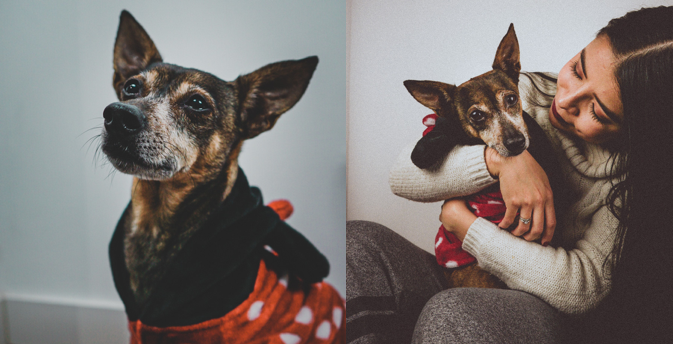
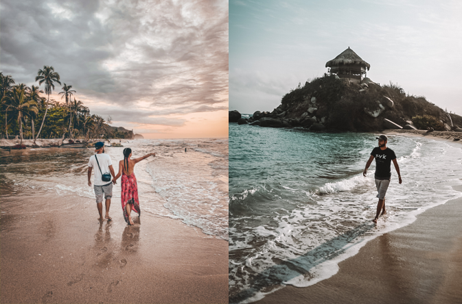

As a new year unfolds, I look back and reflect on what happened in the last 12 months. Here's what my 2020 looked like.

# Family

We welcomed a new family member: Piti. We adopted her in November in Madrid. She's a beautiful 10 years old valencian *puppy*. This is my wife's dream come true.

# Work

I worked for Toptal until April. I was supposed to start working at Amazon in May but then a pandemic happened. I didn't get a new job; it would've been a diservice for both parties to work just a few months. I finally moved to Madrid in September to start my new job as an SDE at Amazon.

# Amazon

I got an offer in January to join Amazon as a Software Development Engineer II in Madrid. It was a tough call; giving up on the digital nomad life was no joke. We decided it was a big move with great things to come.

For me, Amazon meant working with world top talent in huge scale projects. For my wife, Madrid was the perfect spot for her travel business. In September, we sold our place in Colombia, packed 4 bags, and traveled in the middle of the pandemic.

# Travel

COVID19 was a huge blocker to do any travel this year. Despite this, me and my wife did some nomading in Colombia from January to March. We spent 3 weeks in Santa Marta and 3 weeks in Medellín. It was the best time ever. I used to code all day and then watched the sunset at the beach. We used the weekends for daytrips nearby.

We haven't done in traveling in Spain nor do we want to, yet. We keep safe at home. We'll hopefully visit a lot of places when the crazyness is over.

# Books

I read a personal record of 23 books this year. 20 non-fiction; 3 fiction. The books I most enjoyed were *Digital Minimalism* by Cal Newport, and *Man's search for meaning* by Viktor Frankl. The ones I least enjoyed were *The Great Gatsby* and *Mein Kampf vol. II*. All in all, I learned a lot about history, psychology, anatomy, and finance.

# Open source

Being unemployed for 5 months gave me the chance to work on Open Source. I reached [2.5k stars](https://github.com/caroso1222/) on GitHub and [+5M installs](https://www.npmjs.com/package/notyf) on NPM. I released three new projects —[rmind](https://github.com/caroso1222/rmind) being my favorite— and Notyf v3.9.0. I also contributed to Svelte; I'm in love with that project.

I'm pausing my work on OSS in 2021. I'll focus on my job at Amazon and my new life in Spain.

# Money

Five months of unemployment felt hard on my finances. However, I'm so thankful to have had an emergency fund to hang onto. I can't stress enough on this; 1 year of runaway is synonym of mental peace.

I didn't panic when my investments plummeted in March, and I didn't celebrate the bull run in June. I finished the year up +15%, which is solid for a year like this. My Amazon RSUs valuated almost +60%. I also benefitted from the devaluation of the colombian peso against USD. Crypto is still down since 2018 but slowly recovering.

# Personal

I'm grateful COVID19 was not rough for my family. We had enough savings for a 2 year runaway. I did face a lot of uncertainty; Amazon took some months to figure out how to hire remotely. I faced all this with meditation, reading, journaling, waking up early, and keeping busy.

I migrated my personal site from vanilla HTML to this Gatsby blog. It was a great call; I wrote more than 50 posts this year. I posted a lot of my writings in DEV.to, too. As of today, this site is receiving +6k visits per month.

Finally, I wrote a book to help people prepare for the Toptal interview. Alongside with this, I started a mailing list which is now at 2.3k subscribers. I feel like I'm helping people, and that's satisfying.

 

2020 was a year of change, a year to learn. I learned that I have many undeserved privileges. Many people suffered through 2020; I, in contrast, had a great time. I enjoyed solitude, lock down, introspection, and freedom. I even landed an awesome job and moved to Europe.

Life hits hard, bad things happen, and chaos is imminent; suffering, though, is not a consequence — it's a choice.

