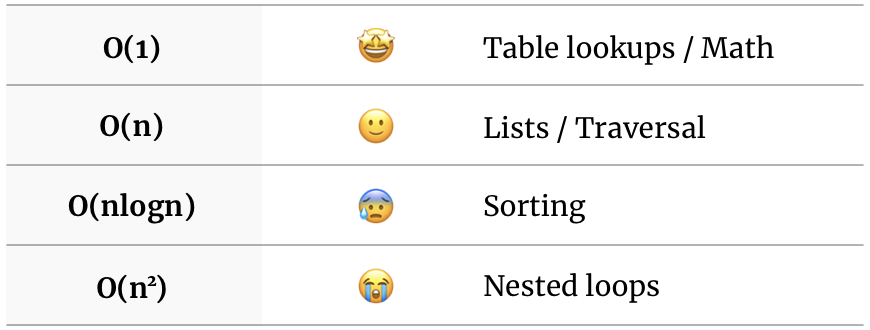

**TL;DR.**
1. Associate O(1) with table lookups and math
2. O(n) is for list traversal
3. The weird logarithm is for sorting: O(nlogn)
4. Connect O(n<sup>2</sup>) with nested loops

<div class="divider"></div>

Whether you agree or not with whiteboard interviews and algorithmic questions, becoming good at this is yet another skill you should master at some point. And, to become good at algorithms, you should grasp the notion of BigO. Notice I wrote "grasp", not "master". There's nothing mystic about this topic. 

BigO is simply a notation that tells you how well or bad your algorithm performs as your input size grows. I've identified some tricks I use from time to time to solve and analyze algorithms.

## 1. Associate O(1) with table lookups and math

Means your algorithm will take roughly the same amount of time regardless of the input size. Applies normally to math operations and object lookups.

```javascript
// regardless of a or b, a sum is a math operation that takes just 
// one clock cycle to complete
const add = (a, b) => a + b;

// no matter of how big your map is (e.g an object in JavaScript), 
// a lookup will take 1 cycle to complete
const lookup = (map, key) => map[key];
```

You know when you access the `bar` prop from the `foo` object like `foo.bar`? Well, that's an O(1) operation.

*Note: Hashmap lookups are considered to be O(1) in theory regardless of how they solve collisions*

## 2. O(n) is for list traversal

Means your algorithm run time will grow linearly with the input. Take, for instance, the algorithm to find the max number of a list. Your algorithm necessarily needs to visit every element to know which number is the max. If your list grows 2x, your algorithm will roughly take twice the time to complete.

```javascript
// you need to loop through all the elements to find the max.
function findMax(list) {
  let max = -Infinity;
  for (obj of list) {
    if (obj > max) max = obj
  }
}
```

## 3. The weird logarithm is for sorting: O(nlogn)

This one is easier than what it looks like. Don't worry about the weird logarithm over there. Logs in BigO notation normally means you're dividing something into halves, and each half is divided again into halves. But, the only thing you need to remember is this: **O(nlogn) is mostly associated with sorting**. Sorting lists are not free operations, you're incurring in costs when using them. Let's see an example of a very inefficient way to get the max of a list:

```javascript
function getMax(list) {
  return list.sort((a, b) => b - a)[0]
}
```

O(n) is better than O(nlogn) because if you multiply 🦄 by logn, you get a bigger 🦄.

Now you have good criteria to decide what's most efficient to find a max. Would you use the O(n)? or the O(nlogn) algorithm?

## 4. Connect O(n<sup>2</sup>) with nested loops

Means your input size affects the algorithm like crazy (not quite as bad as others). If your input size doubles, your run time grows 4x. If your input grows 4x, your run time grows 16x. This normally takes the shape of a nested loop. Let's write a very inefficient way to find if an array has a duplicate.

```javascript
function hasDuplicates(list) {
  for (let [i, el_i] of list.entries()) {
    for (let [j, el_j] of list.entries()) {
      if (i !== j && el_i === el_j) return true;
    }
  }
  return false;
}
```

For every element in the list of size n, we're looping over the whole list of size n. That means we're visiting the elements n*n = n<sup>2</sup> times.

*Can you come up with an O(n) algorithm for this task? one that only loops through the list once? let me know in the comments*

## Summary

No need to dig into this topic if you're against learning algorithms, I can respect that. Just save this table and know that some tasks cost more than others and why.



## Others

There are all kinds of [complexities and nuances](https://www.bigocheatsheet.com/) on this topic. You're free to keep [researching](https://www.youtube.com/watch?v=v4cd1O4zkGw&t=11s). But, if you can grasp these 4 concepts and stick them to heart, you'll level up your algorithms game for interviews, PR reviews, or just to write better code.


