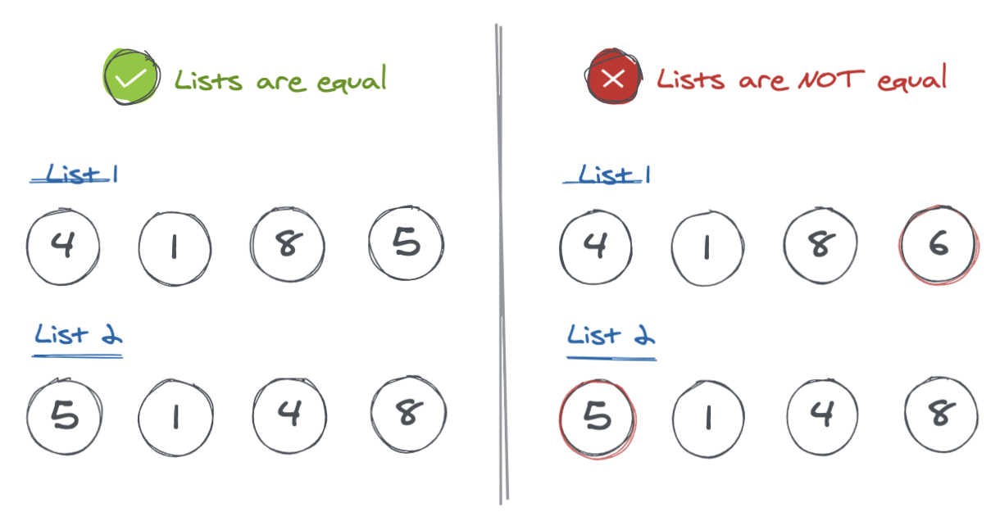
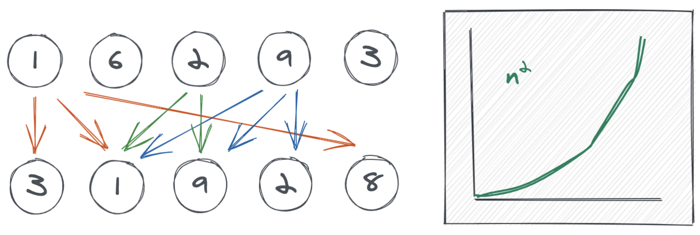
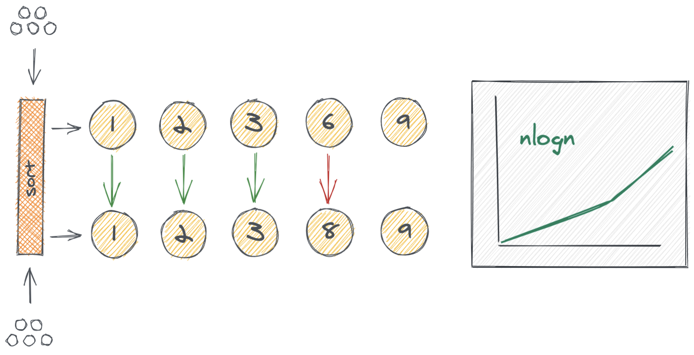
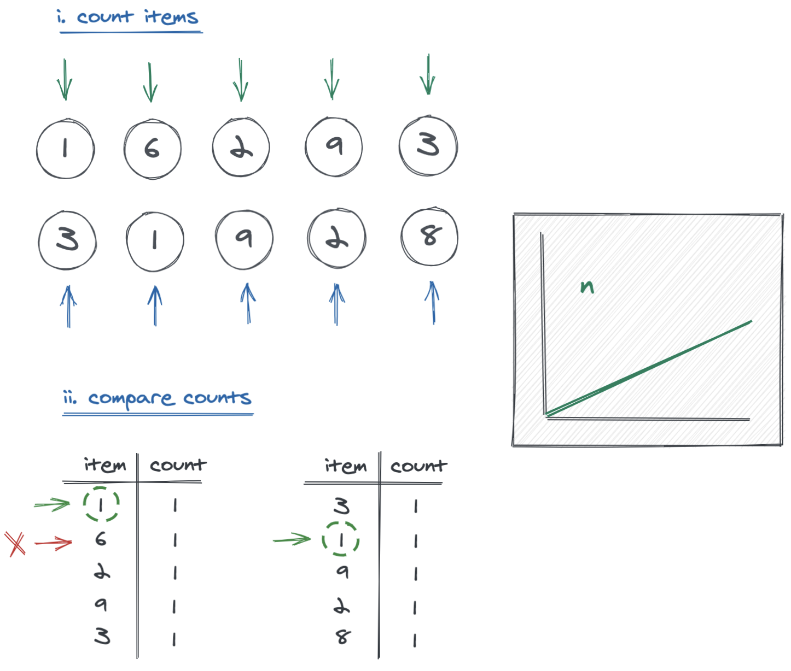

This is an entry level algorithm to get you warmed up for tough interviews like those you get in Amazon, Google, Toptal and top remote work sites. It'll get you exposed to a real life problem with time complexity analysis and data structure exploration.

# The problem

Given 2 unsorted lists, determine if both lists contain the exact same items. You can assume that there's no duplicate item in any of the lists.



# 1. Brute force makes it work

Rule #1 to solve algorithms: Come up with a brute force solution first. **The best solution is simply the worst one after some rework**. How do you normally check if an item exists in two lists? you traverse both lists and try to find the same item in both: *"For every element in list 1, loop through list 2 and try to find it"*.



The figure above shows the comparisons between the lists. Compare `1` to all the items in list 2; then compare `6`, and so on. But, what's that `n2` weird curve at the right? Let's talk about time complexity. 

### BigO: n^2 for the nested loop

Make sure to [read this quick recap on BigO complexity](/4-tricks-to-instantly-boost-up-your-algorithms-game-bigo-made-super-easy/) if you feel lost about this topic. For every item in list 1 you need to loop over all the items in list 2. That is, take item `1` and visit all 5 items in list 2. Rinse and repeat for the remaining items `6`, `2`, `9`, and `3`. That results in 25 comparisons (5+5+5+5+5). A list with 10 items would result in 100 operations. That's why we say out algorithm resolves in quadratic time O(n^2).

# 2. Sorting makes it better

Brute force proved to be effective but not efficient (too many comparisons). Let's get clever. What if we sorted both lists and then compare items by their indices? After all, if both lists are sorted, the first items should be identical (`i=0`), same for the second items (`i=1`), and so on.



As you can tell from the illustration, we first sort the lists and then we make only one comparison per item. We stop when we find a mismatch on 2 items with the same index.

### BigO: nlogn for the sorting algorithm

As [previously explained](/4-tricks-to-instantly-boost-up-your-algorithms-game-bigo-made-super-easy/), sorting arrays bring benefits but it also comes with a cost. The sorting cost is normally understood as O(nlogn). This complexity is better than our brute force solution, though, so we made our algorithm a bit more efficient.

# 3. Counting makes it perfect

O(nlogn) is not "as cool" as we'd like our algorithm to be. Can we do better without sorting, and without a lot of rework? Let's think about this.

If two lists contain the same elements, then I can find the same amount of `1`s in list 1 than in list 2. If I tell you *"I have two `1`s and three `2`s in my list"* you can then count the occurrences of the numbers in your lists and verify we both have the same frequencies. Can you spot the pattern now?

We're changing the problem from "are these list equal?" to "verify both lists have the same frequencies for all items". **We now have a 'counting' problem**: count the frequency of all items in list 1 and compare it with the frequency of all items in list 2. This is what [hashmaps](/hashmaps-like-you-have-never-seen-them/) are useful for.



In the image above, we loop over every item and register in our "frequency" hashmap (*i. count items*). We build a hashmap for every list. For example, we visit item `2` in list 1 and we add a new record in our hashmap: <2, 1>. This means "item `2` appears `1` times in list 1".

Finally, we loop over the keys in the hashmap #1 and compare the values with the same key in hashmap #2 (*ii. compare counts*). If the key is not found in hashmap #2, then the lists are not equal.

It seems like this is a lot more work, so, is this really more performant?

### BigO: n for just one pass at the lists

Let's count the operations:

1. Loop over list 1 only once. That is 5 items.
2. Loop over list 2 only once. That is 5 items.
3. Loop over the keys in the hashmap. That is 5 items (worst case).

This results in 15 operations. If we had 10 items, this would be 30 operations (10+10+10). Hopefully, you can see a linear correlation here: for lists of length `n`, we do `3n` operations. In computer science, we often simplify `O(3n)` to `O(n)`.

We finally arrived at an algorithm with linear execution time. When you understand that `O(n^2)` is worst than `O(nlong)` which is worst than `O(n)`, then you realize we have arrived at our most performant solution.

*Note: This algorithm will also work for lists with duplicate items. Can you understand why? Explain us in the comments!*

<div class="divider"></div>

# Show me the code

Let's see how our most performant solution looks like in code. I'm doing it in JavaScript just for familiarity.

```javascript
function areListsEqual(list1, list2) {
  if (list1.length !== list2.length) return false;

  // count items from list 1
  const map1 = {}
  for (let item of list1) {
    map1[item] = (map1[item] || 0) + 1
  }

  // count items from list 2
  const map2 = {}
  for (let item of list2) {
    map2[item] = (map2[item] || 0) + 1
  }

  // compare the counts, return false if counts dont match
  for (let item in map1) {
    if (map1[item] !== map2[item]) return false
  }

  return true
}

areListsEqual([1,6,2,9,3], [3,1,9,2,8])
```

Here's a [blitz](https://stackblitz.com/edit/typescript-jtgwpu) with the working code. Can you adjust it to work with 3 lists? Send your blitz in the comments!

<div class="divider"></div>


# Key takeaways

If you can only remember one thing from this post, let it be one of these:

1. Find brute force solutions first.
2. Sorting is nice, but it comes at a cost.
3. Hashmaps will land you the job.
