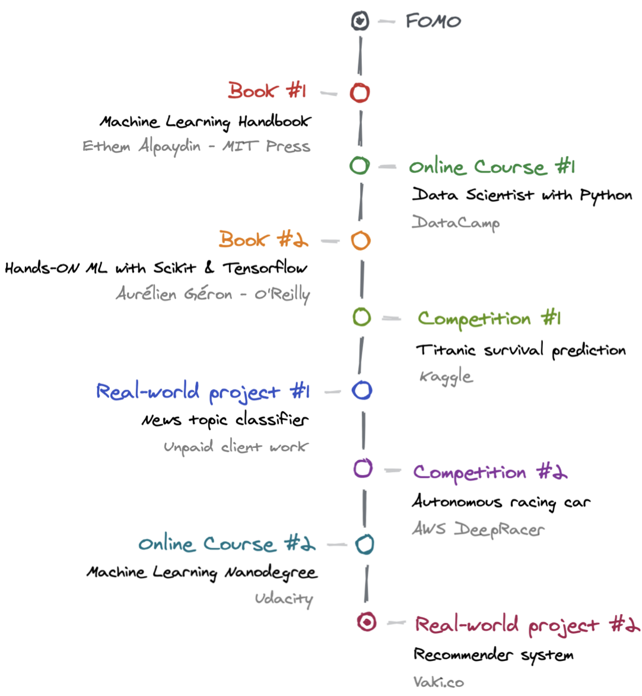
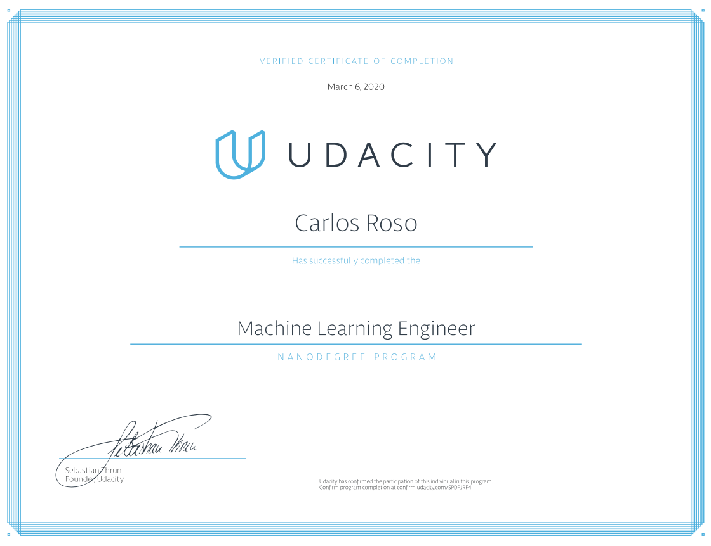

This is the story of how I went from zero to do real client work on Machine Learning. 

I do frontend development for a living and I'm very proud of it. But, for some silly reason, I started to get stressed out to see so many web devs raising so fast. These days you can become a competitive developer in less than a year. I was immature enough to see that as a terrifying, rather than an amazing, fact.

I started telling myself *"I need to learn something harder, something like Machine Learning, so that I get paid a lot more than a web dev"*. Dumb enough, that was my thinking. Only focused on competition and money - all things wrong. In any case, I decided to pursue a journey to learn Machine Learning. All this while working 10hrs/day and traveling full-time. My morning were going to be my ally, so most of this happened every day from 5-8 am (my wife can confirm).

> *I hate overnight success stories like "how I reached X in 3 months", I don't think real progress comes like that, and it's just stressful for the reader. Therefore, I'm just going to say this all happened in the span of a year or so.*

# TL;DR

Here's an overview of my journey. Keep reading if you want to get into more personal details.

# 1. First book

My wife traveled to Boston and got me a beginner-level [Machine Learning handbook](https://mitpress.mit.edu/books/machine-learning) from MIT. She bought it as a surprise for me. She knew I was into this topic, that was cute. This was a very superficial (~150 pages) overview of Machine Learning and its applications. This got me triggered to dive deeper.

# 2. First online course

I then enrolled in the [Data Scientist with Python](https://www.datacamp.com/tracks/data-scientist-with-python) track in **DataCamp**. This was a nice Python refresher for me. It also introduced me to Jupyter and important data science libraries like Numpy, Matplotlib and Pandas.

I didn't pay for this as I got access via a referral from Microsoft Visual Studio. I didn't finish the whole course either, just took a few lessons until I felt I could move on alone.

# 3. Second book

I remember I watched [this YouTube video](https://www.youtube.com/watch?v=1RiFIYwuwHM) which instantly got me into buying the book [Hands-On Machine Learning with Scikit-Learn and TensorFlow](https://www.amazon.com/Hands-Machine-Learning-Scikit-Learn-TensorFlow/dp/1491962291). It was a terrific investment. Not only I could understand the maths behind the *learning algorithms* but I could also dig into the code and practice. By the second chapter, you have already created your first machine learning project. The author also has a GitHub repo with all the exercises for you to cross-check your solutions.

This book is great to learn *supervised* and *non-supervised* learning with Scikit-Learn as well as deep neural networks with Tensorflow. In my view, you'll need to have at least some foundation in algebra and calculus to understand the math.

# 4. First competition

After reading the book from cover to cover I knew I needed real practice to grow. I then tried some luck at the [good ol' Kaggle's Titanic Machine Learning competition](https://www.kaggle.com/c/titanic). This is the "hello world" of Machine Learning competitions. It was a great exercise to practice data manipulation with Pandas and to get familiar with supervised algorithms like KNN and decision trees.

I ended up submitting 3 attempts. I couldn't care less about the scores as I was in for the learning. I was proud I put in the time and self-discipline to finish the challenge.

# 5. First real-world project

I was confident enough to start working on a machine learning project from my company. They didn't know about it, though. I was doing my webdev work as usual, but I put 2-3 extra hours per day (5-8am) to work on this "secret" project. I built a **news topic classifier** for our main product. It would analyze the content on a news article and predict its category (sports, politics, religion, etc) based on previous training.

It was decent enough to work well. When I showed the project, they couldn't care less about it. It was a bummer. I felt like they didn't trust me to tackle a Machine Learning project; my value, for them, was doing JavaScript and CSS, nothing else. I didn't feel like trash, though. **I proved myself I could do ML professionally**. I never let a set back to push me down or let anyone define my worth. I moved on.

# 6. Second competition

I knew Udacity runs competitions to win scholarships from time to time. I went on the hunt and found the [AWS DeepRacer Scholarship Challenge](https://www.udacity.com/aws-deepracer-scholarship) which would grant access to enroll in the [Machine Learning Engineer Nanodegree Program](https://www.udacity.com/course/machine-learning-engineer-nanodegree--nd009t). It seemed like a good chance to gain exposure to Reinforcement Learning and to have a chance to win the scholarship.

**The competition consisted in tuning an autonomous racing car to complete a track as fast as possible**. The idea was to tweak the hyperparameters of the learning algorithm that ran the car, based on training data analysis. Participants must complete 2 laps to qualify. They would then rank the best times and grant the scholarship to the best 200 lap times (out of ~3000 submissions).

**I ended up winning the scholarship** but not for my scores. My scores were crap (not top 200), to be brutally honest. I used most of my AWS credits, I was putting in the time, but my car wasn't just fast enough. But, if I'm not wrong, they were going to grant scholarships for students who had an impact in the community. I created [this repo](https://github.com/caroso1222/awesome-deepracer) with some resources for new competitors and was involved in the conversation on Slack. I think that was what gave me admission. They were also going to give random invites out of thousands of people in Slack. I'm not lucky enough to win such things, but that could've been the reason too.

# 7. Second online course

I switched to part-time in my job and enrolled in the [Machine Learning Engineer Nanodegree Program](https://www.udacity.com/course/machine-learning-engineer-nanodegree--nd009t) with the scholarship I'd won. I quickly realized the course was basic for me (**I wasn't that rookie anymore!**), but I was learning a lot about deploying ML models to production in AWS.

I finished the projects and completed the lessons relatively quickly. That is until I faced the final project. All of this happened while I was digital nomading in the Colombian coast and I had limited time to work full-time, travel and study ML. 

For the final assessment, they offered me a few projects to choose from. They'd give me the data and instructions on how to train the algorithm. You need to develop a machine learning project end-to-end. None of the projects looked appealing to me, though. **I wasn't in the course for the diploma, I was in to have fun and learn**. I then decided to find something meaningful to work on.

# 8. Second real-world project

I reached out to my friend [Nicolás](https://twitter.com/ni500) who happens to run one of the biggest crowdfunding sites in Latin America, [Vaki.co](https://vaki.co/inicio). I'd been thinking in this idea of adding a recommender system to their site, *à la* Netflix or Amazon. I proposed the project and he gave me access to their data right away. He was pretty confident I could solve the problem; I, on the other hand, was not.

I ended up building a hybrid recommender system that would predict recommendations based on two models: Content-Based and Collaborative Filtering. You can read the full report over [here](https://carlos-temp-public.s3.amazonaws.com/udacity-report.pdf).

I got pretty decent results and the model could've worked very well in production. I built the prototype and wrote the report. I was happy to contribute and make the platform much more awesome than what it is now. I hope they can use this model in the future!

The recommender system was the last Machine Learning project I built, and that's for a reason. I proved myself I could learn a discipline which is very distant from my true passion (webdev, design and education). Not only learn, though, but I could also do meaningful work and impact. I could understand the maths and most of the things they call "difficult". However, I don't want to devote myself to something I picked out of FOMO and which doesn't really spark that fire within me. **I have added something new to my toolbox, but I won't necessarily switch paths anytime soon.** 

# Key takeaways

1. The ultimate guide to learn is non-existent. Everyone needs to find their sweet spot. **For me it is print books, pen and paper, and practicing with real/dummy projects.**

2. **Do your best to understand the math.** Tuning hyperparams or reasoning about model performance feels weird without a good foundation.

3. **I'm not a researcher, I'm an engineer.** I'm ok with not understanding all the latest, complex advances in AI and ML. I'm happy to just be able to understand and use common ML tools to solve real problems. For me, Machine Learning is just a means to an end, not the end itself.

4. **I don't like that feedback is very slow on ML.** It's very frustrating for me, coming from a product background, to train a deep neural network for hours just to see garbage results. Not only that, it's very hard to tweak the model as you hardly understand all the internals.

5. **Dive into other topics to grow your toolbox but don't deviate from your true path**, whatever that is. I'd rather double down on my strengths than being a jack of all trades.

Thanks for reading. Never stop learning!
