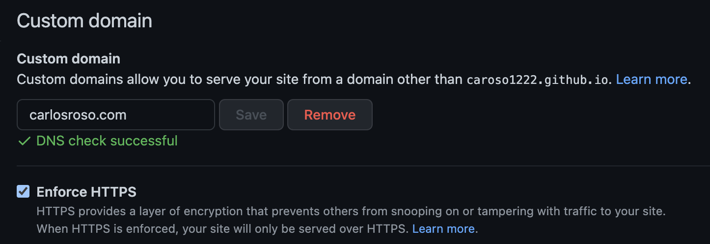

I recently moved my blog from DigitalOcean to GH Pages. Here's what I did to point my GoDaddy domain to GitHub.

## 1. Set up domain in repo settings

In your repository, go to Settings > Pages > Custom domain. Write your domain **without** `www`. 



## 2. Pull changes

Step 1 will add a `CNAME` file to your deployment branch —e.g. `main`. Remember to pull those changes in your local: `git checkout main && git pull --allow-unrelated-histories`.

### 2.1 (Optional) Additional step for Gatsby blogs

If you publish with Gatsby, make sure to add a `CNAME` file to `/static`; it'll be copied verbatim to `/public` in your deployment branch.

```
$ cat <<EOF > ./static/CNAME
mydomain.com
EOF
```

## 3. Configure DNS in GoDaddy

### 3.1 Add an `A` record

Point your root domain to the GitHub Pages IP. Make sure to look at the updated IPs [here](https://docs.github.com/en/pages/configuring-a-custom-domain-for-your-github-pages-site/managing-a-custom-domain-for-your-github-pages-site). I took `185.199.108.153`.

### 3.2 Add a `CNAME` record

Point `www` to your original GitHub pages domain. Do this by adding a `CNAME` record from `www` to `<username>.github.io`.


## 4. Add verified domain

Add your custom domain to your GitHub account —read **acount**, not repo. In GitHub, click on your profile > Settings > Pages. Click "Add a domain".

<div class="divider"> </div>

## Bonus: Automate with Git Hooks

Add a pre-push git hook to deploy your site before pushing changes. Assuming you have a `deploy` npm script and your source branch is `master`, follow this:

```
$ rm .git/hooks/pre-push.sample
$ cat <<EOF > .git/hooks/pre-push
#!/bin/sh
BRANCH="$(git rev-parse --abbrev-ref HEAD)"
if [[ "$BRANCH" != "master" ]]; then
  exit 1;
fi
echo "deploying to gh pages..."
npm run deploy
EOF
$ chmod +x .git/hooks/pre-push
```

