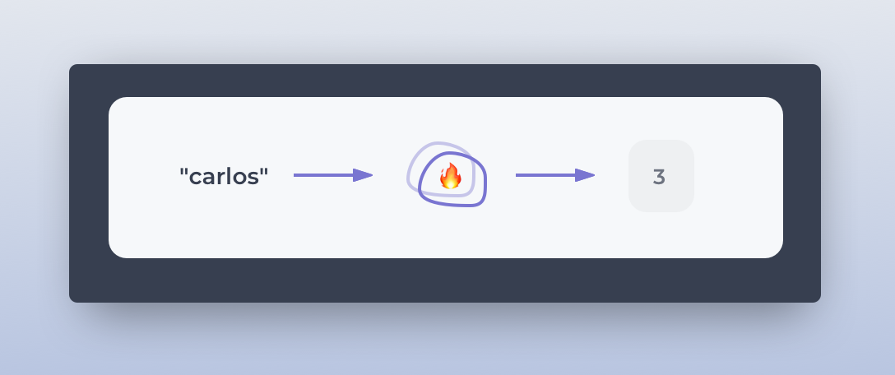
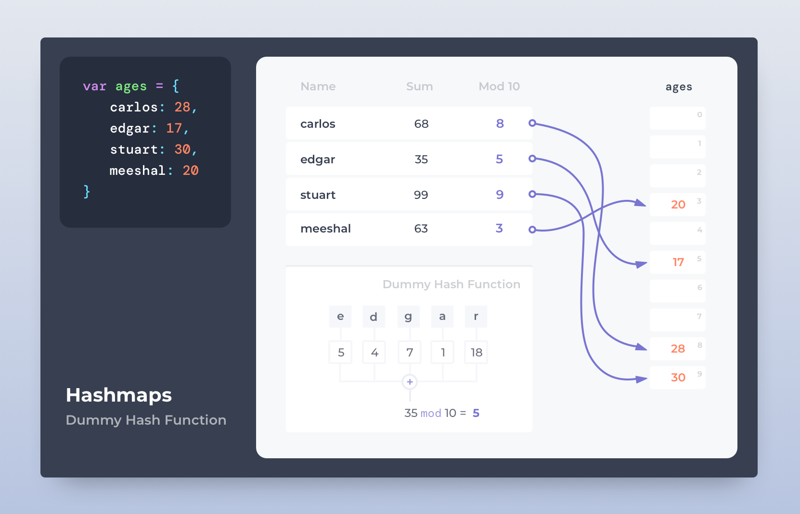
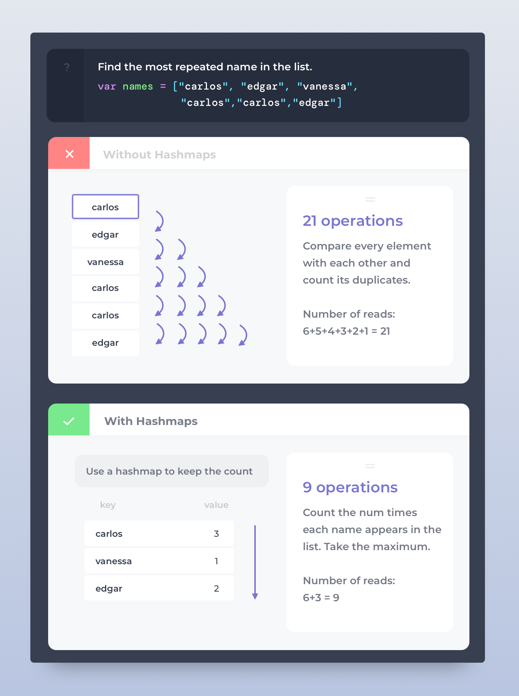
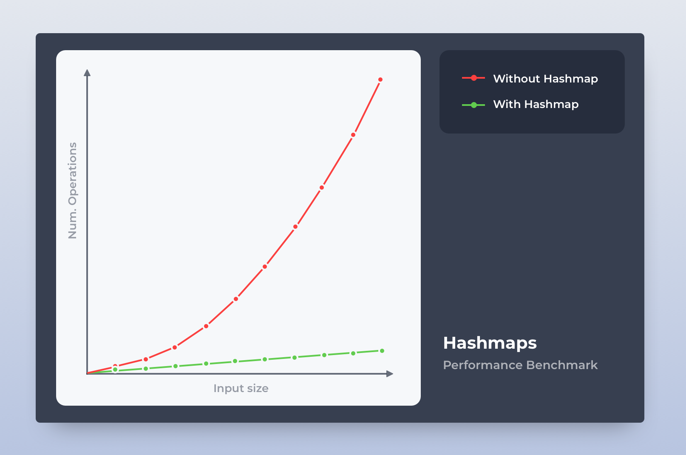

Enter hashmaps. You're using them every day, yet you might not be aware of how it works or why you're preferring them. Why do I say it's the best? not only it is your silver bullet in any coding interview, but it also gives you free performance gains in your day-to-day code.

# Hashmaps disguised as objects or sets

Open your last project and you're almost certainly using hashmaps all over the place. If you're writing JavaScript, they are just plain objects `{ name: 'carlos' }` (not strictly, see final section). Java uses the `HashMap` object, Python call them dictionaries, and Go has maps. Let's see a TypeScript example, just for the sake of the ilustration.

```typescript
const ages: Record<string, number> = {
  carlos: 28,
  leena: 34,
  luigy: 14,
  maria: 54
};
```

So, you're familiar with the concept - you know how it looks like, but, what is it?

# A ridiculously efficient way to read and write

A hashmap is a data structure (ie a piece of code to manage data) which is absurdly efficient to store and retrieve data to/from memory. Think of it like a table with <key, value> pairs. A 'key' is how you identify a 'value'. In the previous section, the keys are 'carlos', 'leena, 'luigy', and 'maria'; the values are 28, 34, 14, and 54.

# Hash. As for 'hash' function

A hashmap is an array on steroids. The difference is that you don't access the array with numeric indices, but instead with objects. How come so? How do you point to something in the array if you don't have its index?

Simple: if you don't have the array index, you need a way to get it from the object.



The fire is the magic. That magic is called **the Hash Function**. It's a way to turn something (string, number, object) into a position within an array. Every programming language has its own esoteric way to write this function. A hashmap can be terribly innefficient or blazing fast depending on its hashing function.

What does a ~~terrible~~ hashing function looks like, then?

# Counting chars

Let's implement a terrible hashing function that only works for keys as strings. It'll map keys to an array of length 10. Here's how our hash function works:

**Our hashing function *h(x)***: Convert every character of string `x` to its numeric position in the alphabet. Sum all these numbers. Divide it by 10 and take its reminder (*aka* modulus %).

Sounds complex, better to show an example:

- h('abc') = (1+2+3) % 10 = 6 % 10 = **6**
- h('carlos') = (3+1+18+12+15+19) % 10 = 68 % 10 = **8**

This means that the map `{ carlos: 28 }` will store the value `28` in the position `3` of its underlying array. Here's a more visual representation of the hashing function concept.



# Free perf gains

By this point, you're sold on the concept. You understand why it's so fast and how it works internally. But, why should you care? How can you apply this concept in real life?

Let's work on an algorithm you might easily come across in your day-to-day job: **Find the most common item in a list of words**. For example, in the list `[4,1,3,4]` the most common element is '4'. There are many ways to solve this but we'll focus on 2 of them here:

1. For every element, find all its duplicates. Return the element that has most duplicates.
2. Count the ocurrences of each element. Pick the element with most appereances.

The first approach requires a nested loop (for every element `i`, loop over all other elements `j` to search this item); the second approach will only need a hashmap. Let's see how they compare in terms of operations.



If you don't understand why 21 and 9 operations, think about this:

1. In the first approach you visit the first item 'carlos' and then **visit the rest of the items to find something similar**. That is: 6 visits. Then you visit the 2nd item 'edgar' and go through the remaining 4 items. That is: 5 visits. Keep doing it until you're left with just 1 element, sum all the visits you pay to the numbers, and you're left with 21 operations.

2. In the second approach you visit the first item 'carlos' and save it in a hashmap with value 1. Every time you find another 'carlos', you'll increment its value in the hashmap. That is, **you need to go over each element just once**, making it 6 visits. The hashtable ends up with 3 items, so you'll need to go over each on of these to find out which one appeared the most (max number). That sums up to 9 operations.

# The larger the input, the better the perf

You might think: *"that's a dumb example just to make your point, 21 vs 9 is nothing for my CPU"*. Let's see what happens when you have an array of 10, 20, 30, ..., 100 items.



As you can see, our algorithm performs much better when using the hashmap than when using the nested loop. **Algorithms should be judged according to their performance when the input approaches infinity**. In fact, the first approach runs in quadractic time `O(n^2)` whereas the one with the hashmap is linear `O(n)`. That's [BigO notation](/4-tricks-to-instantly-boost-up-your-algorithms-game-bigo-made-super-easy/).

Knowledge is power. You have now an additional piece of power to make your code a bit more efficient with Hashmaps!

# Tip of the iceberg

This was just a introduction to a data structure I personally find very useful and interesting (literally the best one you can ever learn). That being said, this was just the tip of the iceberg of a huge topic. There's a lot of complexity involved when dealing with hashmaps. If you feel intrigued, I invite you to keep researching the following topics:

- [Collision handling](https://javarevisited.blogspot.com/2016/01/how-does-java-hashmap-or-linkedhahsmap-handles.html): 'carlos' and 'mike' both map to the same array index `8`. What happens then? how do you retrieve an element if its hash collides with another key?
- [Load factor](https://stackoverflow.com/questions/10901752/what-is-the-significance-of-load-factor-in-hashmap): What happens when the list is full? the list should grow from 10 elements to 20, how does it decide when to do it?
- JavaScript may not be using Hashmaps to store objects. [How does it do it, then?](https://channel9.msdn.com/Shows/Going+Deep/Expert-to-Expert-Erik-Meijer-and-Lars-Bak-Inside-V8-A-Javascript-Virtual-Machine)
- Just to feed your curiosity, [watch how Google built a super fast and efficient Hashmap](https://www.youtube.com/watch?v=ncHmEUmJZf4).

<div class="divider"></div>

I hope you got some value from this post and learned something new. Be more mindful about the code you write, think about performance and the underlyings. Hashmaps will also help you ace a lot of interviews in your career, [believe me](/how-i-got-into-the-most-exclusive-remote-working-platforms/).
