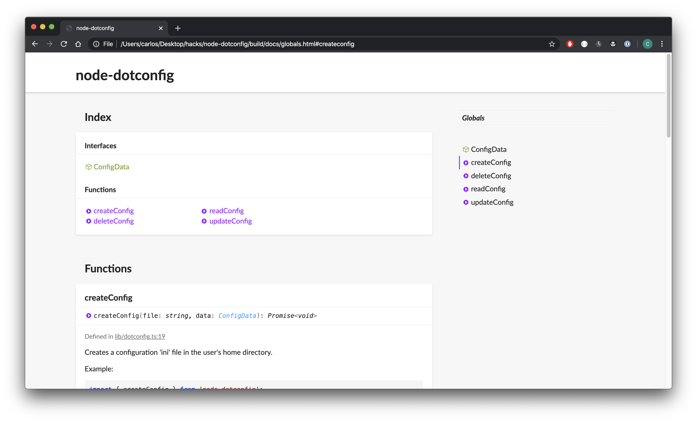

According to the [official docs](https://typedoc.org/guides/themes/#custom-themes) creating a custom theme requires the default theme assets to be copied on the theme. We're just interested to tweak a few CSS props so we don't need the rest of the files (layouts, partials, templates, etc).

1. Create the directory in your project which will hold the custom theme.

```bash
$ mkdir custom-theme
```

2. Copy the `main.css` file from `node_modules/typedoc-default-themes/bin/default/assets/css/main.css` and paste it in `custom-theme/assets/css/main.css`.
*Note: The [official docs](https://typedoc.org/guides/themes/#custom-themes) say you need to copy the assets from [typedoc-default-themes](https://github.com/TypeStrong/typedoc-default-themes/tree/master/src/default/assets) but it won't work as it will only download a bunch of sass files.*

```
$ mkdir -p custom-theme/assets/css    
$ cp node_modules/typedoc-default-themes/bin/default/assets/css/main.css custom-theme/assets/css
```

3. You can now edit the styles as you please. For example, the snippet below hides the legends, the navbar and sets a different font family. I did this for [node-dotconfig](https://github.com/caroso1222/node-dotconfig) as it's a pretty small utility and I wanted to keep the docs simple.

```css{numberLines: true}
@import url('https://fonts.googleapis.com/css2?family=Lato:wght@300;400;700&display=swap');

footer {
  display: none;
}

.tsd-page-toolbar {
  display: none;
}

.tsd-page-title {
  padding-top: 30px;
}

body {
  font-family: "Lato", sans-serif;
}
```

4. Run typedoc with the `--theme` configuration or edit your config file (`typedoc.json` or `typedoc.js`):

```
$ typedoc --theme ./custom-theme
```

Or with  `typedoc.json`

```json
{
  "...": "...",
  "theme": "./typedoc-theme"
}
```

5. Profit


