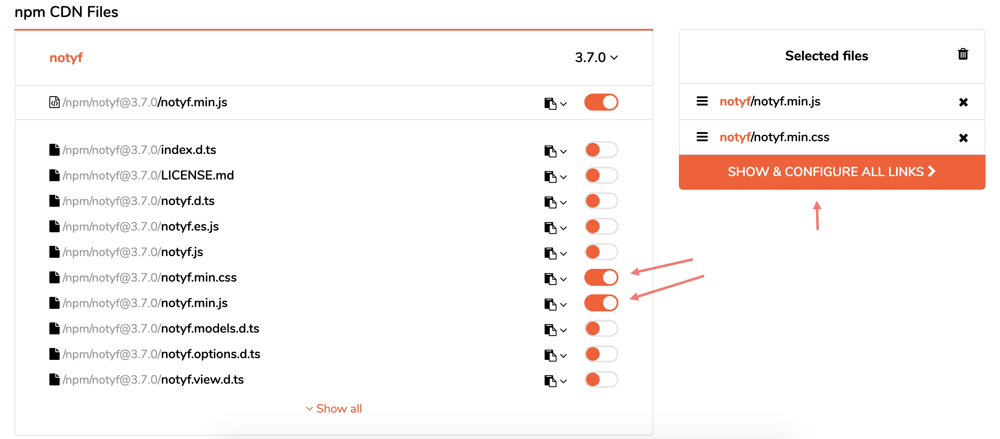

I never thought about distributing my JavaScript libraries (for client) with anything different than just NPM. It was only when I saw [this issue](https://github.com/caroso1222/notyf/issues/64) on one of my PRs that I realized I could distribute this over a CDN.

It turns out [jsdelivr](https://www.jsdelivr.com/) already does this automatically. You don't even need a setup to get it working. Let's see how to get the URLs and that precious badge for your repo.

## Packaging

If you're not doing it already, make sure you pack minified files either on your NPM package or your GitHub repo. You should adjust your build process to include these files in your final dist folder (or add it to the `files` prop of your package.json).

Publish the minified files within your package on NPM.

## JSDelivr

1. Go to [jsdelivr.com](https://www.jsdelivr.com/)
2. Search your package using the search bar. It should take you to an URL like [this](https://www.jsdelivr.com/package/npm/notyf).
3. Grab the code for the badge at the top right part of the screen. I prefer to switch it to the *Default Style* view. It should look like this:

<div style="text-align: center">

[](https://www.jsdelivr.com/package/npm/notyf)

</div>

The code to render the badge in Markdown will probably look like this:

```
[](https://www.jsdelivr.com/package/npm/notyf)
```

4. Select which files you want to see the URL for.
5. Click on "Show & Configure all link"

6. In the next screen, make sure to check **HTML output** and **Version aliasing** so that your users get the latest non-breaking changes everytime you publish a new version.
7. Copy the codes, paste them in your repo. It should look like this:

```html{numberLines: true}
<html>
  <head>
    ...
    <link rel="stylesheet" href="https://cdn.jsdelivr.net/npm/notyf@3/notyf.min.css">
  </head>
  <body>
    ...
    <script src="https://cdn.jsdelivr.net/npm/notyf@3/notyf.min.js"></script>
  </body>
</html>
```
