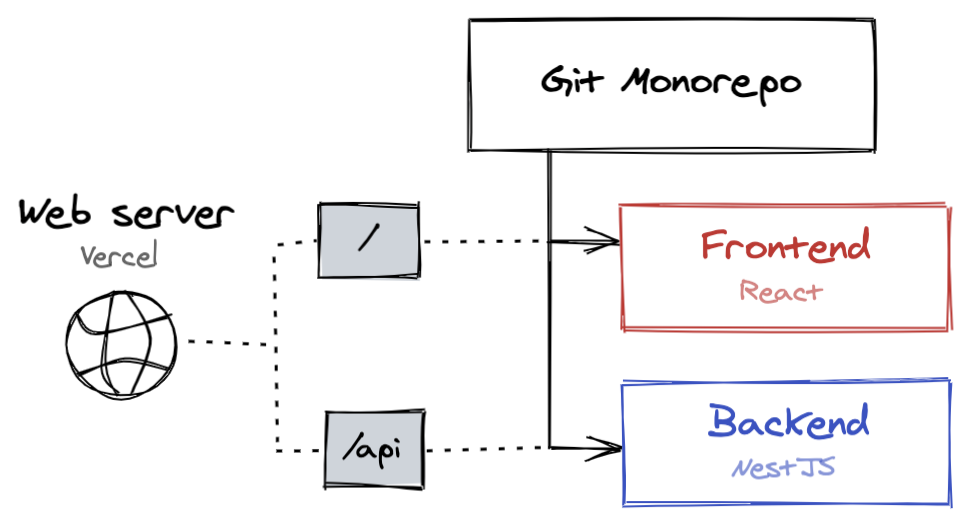
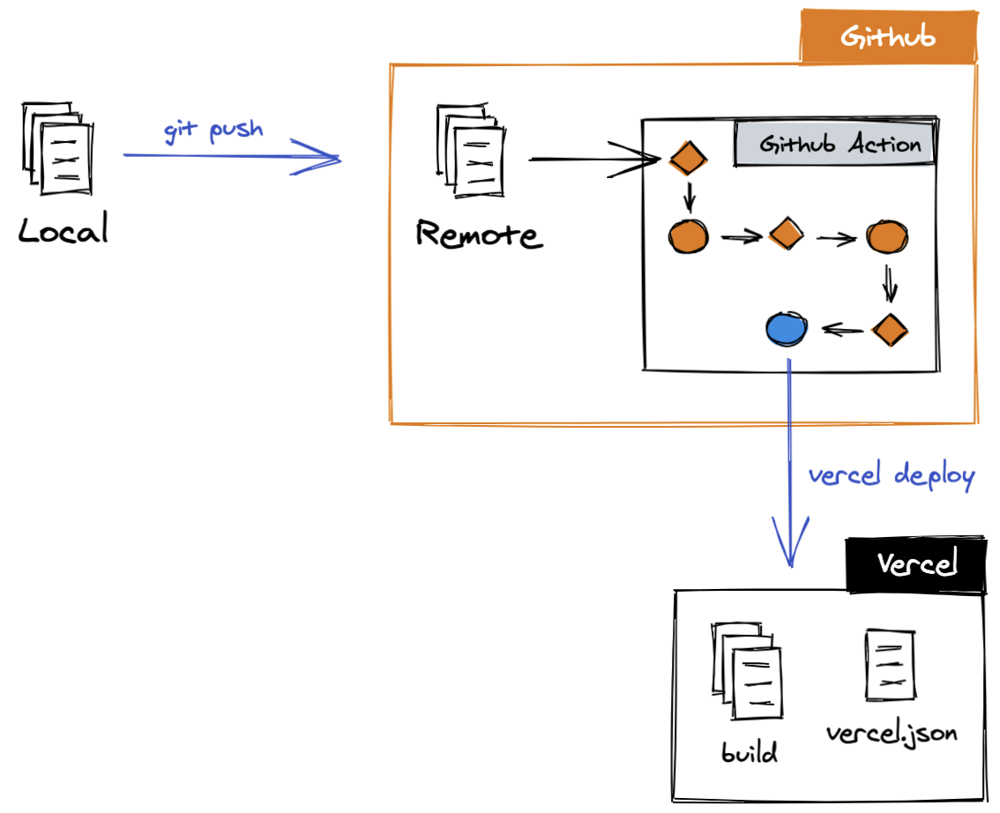

# The problem

We need to deploy a monorepo in Vercel which holds a frontend app (React) and a backend API (NestJS). We want the following perks too:

- It needs to be done using the free plan. 
- We want to serve the API when the URL matches `/api`; otherwise, serve the React app and its static assets. 
- Both projects should be deployed on `git push`.



# The constrain

We can configure Vercel to automatically deploy your project on `git push`. We'd need then to configure two projects in Vercel: one for the frontend and another one for the backend.  However, **we can't link 2 projects to the same repo in Vercel**. This means we won't do continuous deployment in Vercel.

# The solution

Based on the constrain mentioned above, we'll need to **disable automatic Github deployments** for Vercel. [You can do this](https://vercel.com/docs/configuration#git-integrations/github-enabled) by setting `"github": { "enabled": false }` in your `vercel.json` file (more on this later.).

## Deploy from local

We can build the monorepo locally and execute the `vercel` deploy command. We'll then need to tell Vercel something like this:

> *There are 2 builds in this project. `dist/api/index.js` should be served as a Node app under the `/api` endpoint. `dist/frontend/index.html` should be served as a static folder under any other endpoint.*

The way we can communicate this to Vercel is by writing a `vercel.json` file. Ours looks like this:

```json{numberLines: true}
{
  "version": 2,
  "scope": "my_own_vercel_scope",
  "github": {
    "enabled": false
  },
  "builds": [
    {
      "src": "/dist/apps/api/main.js",
      "use": "@now/node"
    },
    {
      "src": "/dist/apps/react-app/*",
      "use": "@now/static"
    }
  ],
  "routes": [
    { "src": "/api/(.*)", "dest": "/dist/apps/api/main.js" },
    { "handle": "filesystem" },
    { "src": "/assets/(.*)", "dest": "/dist/apps/react-app/assets/$1" },
    { "src": "/(.*).(js|css|ico)", "dest": "/dist/apps/react-app/$1.$2" },
    { "src": "/(.*)", "dest": "/dist/apps/react-app/index.html" }
  ]
}
```

Please note that the order in `"routes"` is important as the Vercel's web server will execute the first match of the URL to the `"src"` regex.

**We can now build our monorepo locally and then deploy both frontend and API running `vercel`**. The process of creating the project in Vercel is out of the scope of this blog post and can be learned using the [official docs](https://vercel.com/docs/v2/platform/projects).

## Automatic deploy on git push

If we can deploy our monorepo from local then we can probably deploy it from any machine. In particular, we can use Github servers to do so via [Github Actions](https://github.com/features/actions). **We'll then configure a Github Action to detect git updates (master, new branch, etc) and deploy on Vercel**. We'll use `amondnet/vercel-action` for this purpose (see [docs](https://github.com/amondnet/vercel-action)).



To achieve this, we need to create the file `.github/workflows/deploy-vercel.yml` from the project root, with the following content:

```yaml{numberLines: true}
# Monorepo deploy vercel
name: Deploy Vercel
on:
  push:
    branches: [master]
  pull_request:
    branches: [master]

jobs:
  deploy:
    runs-on: ubuntu-latest
    steps:
      # Checkout and install
      - name: checkout
        uses: actions/checkout@v2
      - name: NPM Cache
        uses: actions/cache@v1
        with:
          path: ~/.npm
          key: ${{ runner.os }}-node-${{ hashFiles('**/package-lock.json') }}
          restore-keys: |
            ${{ runner.os }}-node-
      - name: Install deps
        run: npm ci
      # Build and deploy
      - name: Build
        run: npm run build
      - name: Deploy staging
        uses: amondnet/vercel-action@v19
        id: vercel-action-staging
        if: github.event_name == 'pull_request'
        with:
          github-token: ${{ secrets.GITHUB_TOKEN }}
          vercel-token: ${{ secrets.VERCEL_TOKEN }}
          vercel-org-id: ${{ secrets.ORG_ID }}
          vercel-project-id: ${{ secrets.PROJECT_ID }}
      - name: Deploy production
        uses: amondnet/vercel-action@v19
        id: vercel-action-production
        if: github.event_name == 'push'
        with:
          github-token: ${{ secrets.GITHUB_TOKEN }}
          vercel-token: ${{ secrets.VERCEL_TOKEN }}
          vercel-org-id: ${{ secrets.ORG_ID }}
          vercel-project-id: ${{ secrets.PROJECT_ID }}
          vercel-args: '--prod'
```

You can understand the build and deploy workflow by reading the `steps`: *checkout, NPM cache, Install deps, Build, Deploy staging, Deploy production*. The *deploy* steps are of particular interest. Let's analyze them.

As inferred from the YAML file, *Deploy staging* is executed when there's a new pull request, and *Deploy production* runs whenever there's an update on `master` (see `if: github.event_name == 'push'`). Notice that the difference between both deployments is the flag `vercel-args: '--prod'`. This will tell Vercel to use the production domain. It will also make the production environment variables available at runtime.

## Setting up the Github secrets

Notice the use of `secrets` in the YAML file. [Please refer the official docs](https://docs.github.com/en/actions/configuring-and-managing-workflows/creating-and-storing-encrypted-secrets#:~:text=On%20GitHub%2C%20navigate%20to%20the,Click%20Add%20a%20new%20secret.) to learn how to add secrets to a Github repo. Here's a brief guide on how to get each one of the secrets:

- `GITHUB_TOKEN`: This is automatically set by Github when running the action. No further action needed.
- `ORG_ID` and `PROJECT_ID`: When you run `vercel` locally for the first time, you'll be asked to login to your Vercel account and link your repo to a project. Once you finish this configuration, a new `.vercel/project.json` file will be created in your project. Use the values for `"orgId"` and `"projectId"` for the Github secrets.
- `VERCEL_TOKEN`: Create a new token from your [profile settings](https://vercel.com/account/tokens). Copy that token and paste it in the corresponding Github secret.

## Real-life project

I deploy [logoquiz.dev](https://logoquiz.dev) with this same technique. The code is [open source](https://github.com/logo-quiz/logo-quiz) if you're curious to see all this in action.
