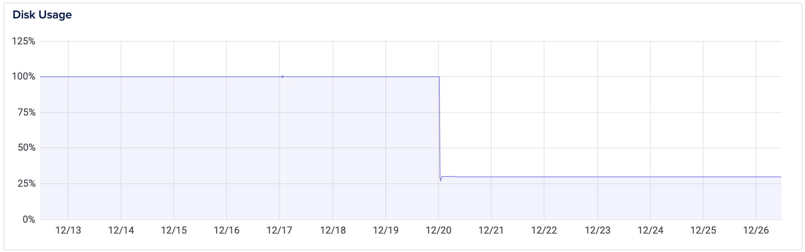
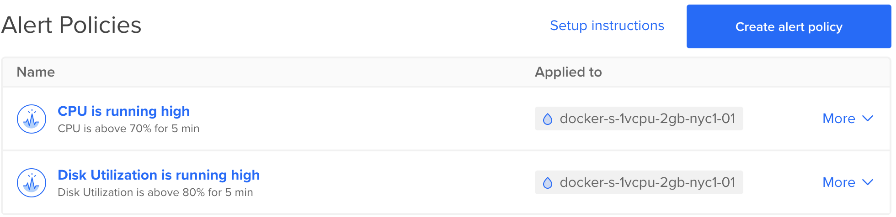

# TLDR

```
$ docker system prune -a -f
```

<div class="divider"></div>

# The problem

All of a sudden my [build server (aka droplet)](../deploying-frontend-applications-the-fun-way) in DigitalOcean stopped building images. The Jenkins output for the failing job showed "No disk available". Here's what the disk usage metrics looked like:



Notice the fix when disk utilization bumped down from 100% to 30%. Let's see what happened.

# The root cause

I have a native Jenkins installation in my droplet. Every job builds a docker image and pushes it to DockerHub. **This was leaving dangling images after every build, thus consuming unnecessary disk space.** These images are left in folder `/var/lib/docker/overlay2`. 

```
$ cd /var/lib/docker
$ du -sh ./*/
20K	    ./builder/
...
30.4G	./overlay2/
...
28K	    ./volumes/
```

As shown above, the dangling images accounted for 30.4 GBs. You can also see this with with `docker images -a`; the offending images are tagged as `<none>`. 

# The fix

Get rid of all those dangling images with docker prune:

```
$ docker system prune -a -f
$ cd /var/lib/docker && du -sh ./*/
20K	    ./builder/
...
148K	./overlay2/
...
28K	    ./volumes/
```

Notice how I went from 30.4G to 148K in `overlay2`.

# The real solution

It'd be ideal to build the image and remove the intermediate images in the process. I haven't dig into this yet but [this SO](https://stackoverflow.com/a/55082473/3468917) answer looks promising.

# Set an alarm

Finally, it's always good to instrument your droplets and set alarms to act early on. In your Digital Ocean account go to **Monitoring > Create alert policy**. Select **Disk Utilization** and set a threshold of 80%.



