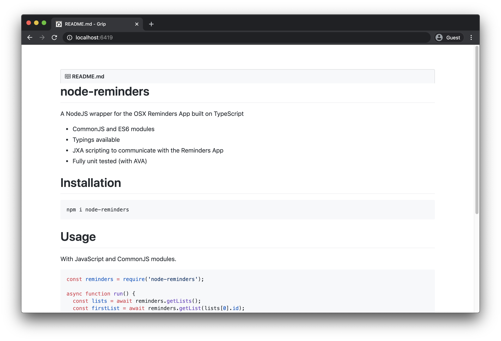
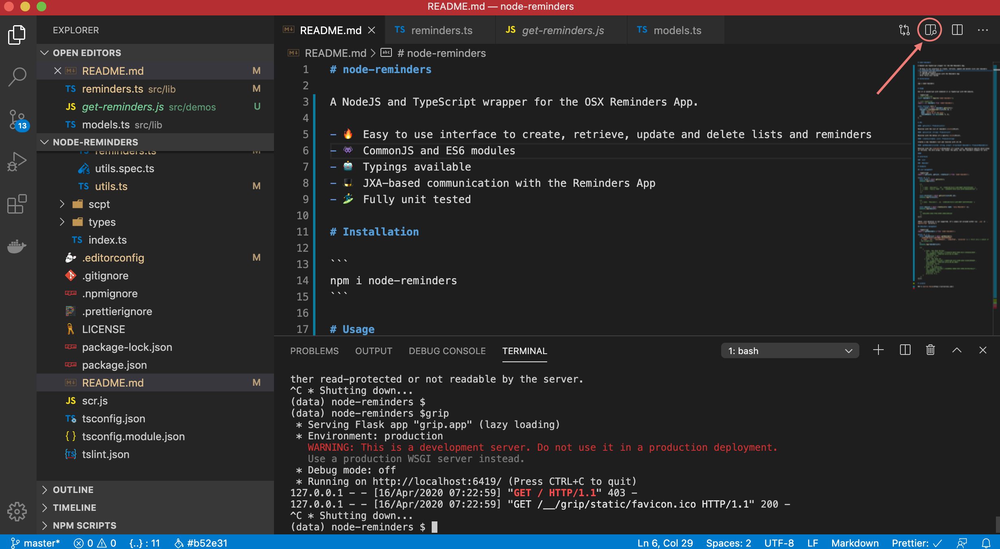
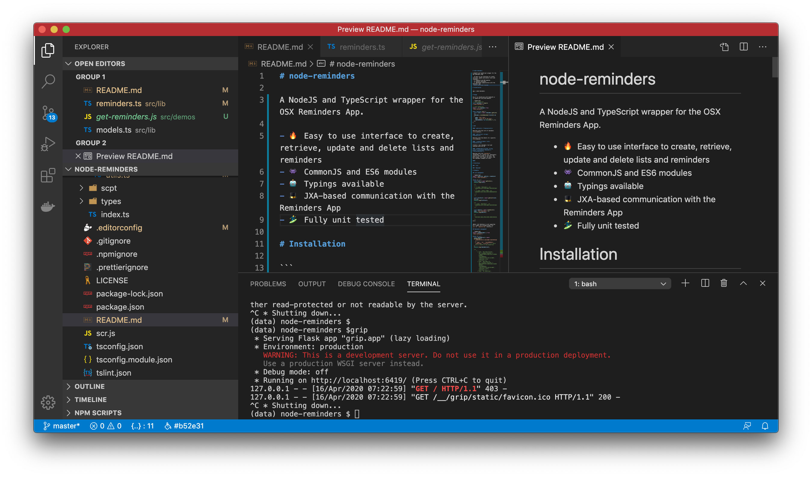

After trying a lot of tools there's only one that have worked flawlessly for me. It's a Python module called [grip](https://github.com/joeyespo/grip).


# Installation

You can either install it using [Homebrew](https://brew.sh/) (**recommended**) or Python.

## Homebrew

```bash
$ brew install grip
```

*You can skip to the Usage section now*.

## Python

I normally recommend using [virtualenvs](https://virtualenv.pypa.io/en/latest/) to install anything in Python. Install that along with [virtualenvwrapper](https://virtualenvwrapper.readthedocs.io/en/latest/command_ref.html).


1. List your virtualenvs
```bash
$ lsvirtualenv
myenv
====
bar
====
```

2. Activate one environment
```bash
$ workon myenv
(myenv) $
```

3. Install `grip`
```bash
(myenv) $ pip install grip
```

# Usage

To render the readme of a repository:

```
$ cd my-repo
$ grip
 * Running on http://localhost:6419/
```

To render a specific markdown file:

```
$ grip CONTRIBUTE.md
 * Running on http://localhost:6419/
```

Open your browser at `http://localhost:6419`. Profit.



# API Limits

Grip uses the Github API directly to render the markdown files. This is fine until you hit the 60 API requests / min limit. From there, you can use basic auth to increase the limit to 5000 requests / min:

```
$ grip --user johndoe --pass foobarbaz
```

Or, you can just use the VSCode markdown previewer for a while until you get access to Github again. Click on the top-right icon with the glass to preview the markdown.



And this how it looks like:



