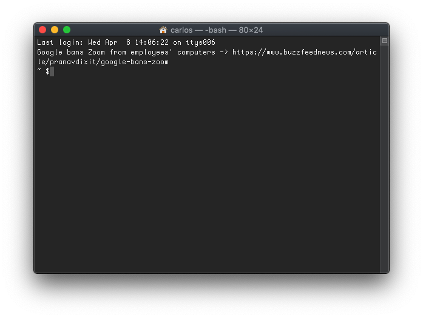

I've been familiar with `.bash_profile` for a while now but little I knew all the things I could do with it. Here are some cool things I just learned.

# Alias

I have some custom commands like opening Gmail from the terminal with the command `gmail`. To do that, I used to throw my custom shell scripts within a folder and point it from my PATH. Something like this:

```bash
$ cat ~/.bash_profile
PATH=$PATH:~/custom-scripts
export PATH
$ cd ~/custom-scripts
$ echo -e '#!/bin/bash \n open https://mail.google.com' >> gmail
$ chmod +x gmail
$ gmail
```

That works but it's way too overkill for that purpose. I later discovered I could use an `alias` within `.bash_profile` instead. An alias lets you mask long commands with shorter, easy to remember shortcuts. Let's see how it looks like now:

```bash
$ cat ~/.bash_profile
alias gmail="open https://mail.google.com"
```

The result is pretty much the same. Running `gmail` will open Gmail right in my browser. I've since added some more alias of my own and some others I found online. Let's see what my current alias look like now:

```bash
alias g="git"
alias back="cd -"
alias ll="ls -lhA"
alias ls="ls -CF"
alias ..="cd .."
alias gmail="open https://mail.google.com"
```

You might already have some of these in your system. Type `alias` in your terminal to find out. Now go get some inspiration for more alias, try googling [best bash alias](https://www.google.com/search?safe=strict&sxsrf=ALeKk0291I19hZNnVFQmCgEOEhYXxSrsQg%3A1586379351030&ei=VzqOXrupAaORggfHxJa4Cw&q=best+bash+alias&oq=best+&gs_lcp=CgZwc3ktYWIQAxgAMgQIIxAnMgQIIxAnMgYIIxAnEBMyBAgAEEMyAggAMgIIADICCAAyAggAMgIIADICCAA6BQgAEM0COgUIABCDAUogCBcSHDBnMTQ0ZzE5MmcxNjlnMTY1ZzE3NGcxMS0xNzdKFAgYEhAwZzFnMWcxZzFnMWcxMS0zUJbwHliK8x5g5PseaAJwAHgAgAHHAYgBqQqSAQMwLjiYAQCgAQGqAQdnd3Mtd2l6&sclient=psy-ab).

# Functions

It turns out you can create some sort of *alias* for processes that require more elaborate user interaction. These are bash functions and, when placed within `~/.bash_profile`, they will execute like any other command. Let's see an example of a function that creates a folder and changes directory immediately:

```bash
mkcdir () {
  mkdir -p -- "$1" &&
  cd -P -- "$1"
}
```

You can see how `$1` captures the first argument, place it in front of `mkdir` and then `cd` into it. From now on, running `mkcdir my-folder` will create a folder `my-folder` and change directory immediately.

Bash functions were game changers for me and I've since added some more to my collection, this what my `bash_profile` looks like now:

```bash
# Creates an alias from terminal.
# Usage: als gsheets open\ sheets.google.com
als () {
  echo "alias" $1'="'$2'"' >> ~/.bash_profile
  source ~/.bash_profile
}

# Computes a math calculation
# Usage: c 1+1
c () {
  printf "%s\n" "$*" | bc
}

# Creates a folder and 'cd' into it
# Usage: mkcdir my-folder
mkcdir () {
  mkdir -p -- "$1" &&
  cd -P -- "$1"
}
```

# Fun

Your system runs or "sources" `~/.bash_profile` every time you open the terminal. This means you can do something fun by running functions (not only declaring it) in the `~/.bash_profile`. Think about getting tips on shell scripting, TypeScript, React, listing your reminders, etc. This time, I implemented a function to retrieve the most popular post in HackerNews every time I open a new terminal. Open your profile file `vim ~/.bash_profile` and paste the following code:

```bash
show_top_hn() {
  post_id=$(curl -s https://hacker-news.firebaseio.com/v0/topstories.json?print=pretty | jq '.[0]')
  item_request=https://hacker-news.firebaseio.com/v0/item/item_id.json?print=pretty
  item_data=$(curl -s "${item_request/item_id/$post_id}")
  title=$(echo $item_data | jq -r '.title')
  url=$(echo $item_data | jq -r '.url')
  echo "$title" "->" "$url"
}

show_top_hn
```

*Note: I'm using the official [HackerNews Firebase API](https://github.com/HackerNews/API). You'll need to [install jq](http://macappstore.org/jq/) to process the API JSON Response.*

Now run `source ~/.bash_profile`. Open a terminal. **Lo and behold**.



<div class="divider"></div>

What kind of alias and functions do you have in your `~/.bash_profile`? Let me know on [Twitter](https://twitter.com/caroso1222)!
