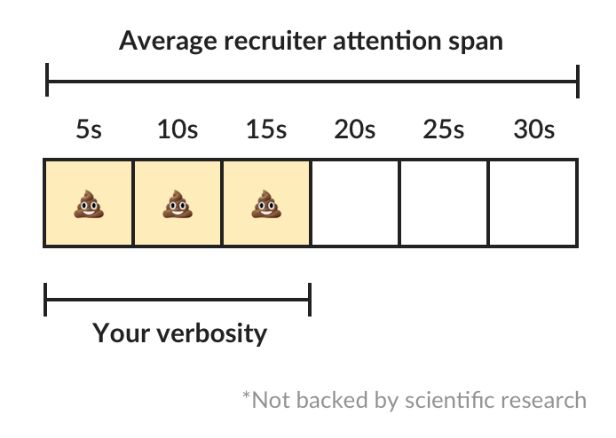

I have something very important to tell you but, before I do it, I'd like to talk to you about myself. I'm a very charismatic, process-oriented person with self-learning abilities. I'm also a very strong team player with a passion for building and creating new things. On top of that, I have organization and proactivity skills that allow me to produce high-quality work. I have good verbal and written communication which makes me a great team player. Finally, I'm always inspired to do more than expec...

Alright, **that's enough**, I think you got the point now.

# The art of going straight to the point

The one and only thing you should do in your resume is **going straight to the point**. This applies to everything but, mostly, to your summary. That first paragraph should be your 10 seconds aggressive pitch. 

One thing you perhaps didn't know: In paper everyone is charismatic, everyone is a great *team player*, and everyone has great written skills (eye roll). Everyone is efficient and organized. Every single developer likes to learn new things! You're wasting your recruiter's attention on useless verbosity which says nothing about **what makes you different**.

*"Sure, but, they still have time to go over my soft skills, don't they?"*

## The myth of the 12 seconds attention span

Some say humans have the attention span of a goldfish which is like 8-12 seconds. The BBC [debunked that myth](https://www.bbc.com/news/health-38896790) a few years ago. But, being brutally honest, do we need more research to accept our attention span is dead-limited?

Let's say your average recruiter has 30 seconds to make a first impression about you (and 30 seconds is a lot these days). Time yourself reading the first paragraph of this post. I'll save you the hassle: it'll take you roughly 13-18 seconds. That being said, **do you really want to waste half of your recruiter's attention span with your verbosity**?

# Cut the cr#p

So, by now you're sold. Or perhaps not. Maybe you still think your great verbal skills (on paper) makes you a gold-special developer. In any case, just to put it crystal clear: **avoid unnecessary verbosity and cut all those soft skills from your resume's summary**. They are very important on your day job but they have no place in your resume.

Are you a good learner? cool, make me infer that by pointing me to your learning in Python, C++ and Svelte. Are you a strong leader? nice, make me see that in your work experience when you lead a team of 5 devs to ship 8 microservices serving 25k requests per day. Are you a charismatic, people-oriented person? great, then I should infer that when you tell me you're a speaker, a blogger, an online course teacher.

Let's practice. This post would be incomplete if I don't show you an example of what to avoid and how to improve. Remember the Resume Golden Rule (which I just made up): **you have less than 30 seconds to convince your recruiter to keep reading your resume**.

## Example 1: Frontend Developer

### Bad

> Proactive Frontend developer with a passion for learning new things. Strong team player, highly proactive and very process-oriented engineer. Experienced with Vue and React. Respectful and with great written and communication skills.

### Better

> Frontend developer with experience building client-side webapps on React and Vue. Obsessed for impact, I've shipped under 10 robust React applications for thousands of users worldwide. Backend enthusiast with intermediate knowledge in API design (2 deployed APIs on NodeJS). Occasional tech blogger with more than 10k reads a month. Passionate for pixel-perfect frontend apps.

What can you tell about the first person? What about the second? If you're looking for a React developer, which one makes you want to keep reading?

## Example 2: Backend Developer

### Bad

> Experienced backend developer with great teamwork skills. Problem solver and decision maker with good verbal communication abilities. Experience building apps with Rust and Go. Self-motivated and passionate for making positive impact.

### Better

> Backend developer with 10 years of experience building applications in Rust and Go. Specialized in fault-tolerant, highly-reliable systems. I've deployed services in AWS and Azure which scaled to +10 million requests per month. Open source contributor with 300 stars across 6 repositories. Occasional speaker in tech conferences.

## Example 3: Product Manager

### Bad

> Customer-oriented product manager with highly tuned problem solving skills. I combine my organizational and planning abilities to make great impact on organizations. Respectful and strong team player. Experience in planning tools and scrum master.

### Better

> Senior product manager with over 10 years of experience in product and project management. I've worked for fortune 500 companies in retail, manufacturing and energy. Experience leading teams of +20 developers and designers shipping products to +100k users worldwide. Passionate for customer-centric design and UX.

That's it. You're now set to write a simple but strong summary, right straight to the point.

Don't feel bad if you're resume looks like everything I just called out. I've been in that position too but I've read books, watched a lot of YouTube and sent dozens of resumes to get better at it. Feel free to polish your resume and shoot it to me in a [DM on Twitter](https://twitter.com/caroso1222). I'd love to give you my opinionated review.

# Acing that tech interview

I've used this technique to land interviews (and job offers) at Amazon, Toptal and a few more top remote work platforms. Now I'm writing a [FREE guide](/cracking-the-toptal-interview) with a lot of **tips and tricks to ace remote tech interviews**. If you're curious, you can [sign up on the waitlist here](/cracking-the-toptal-interview) and be the first to get it.

