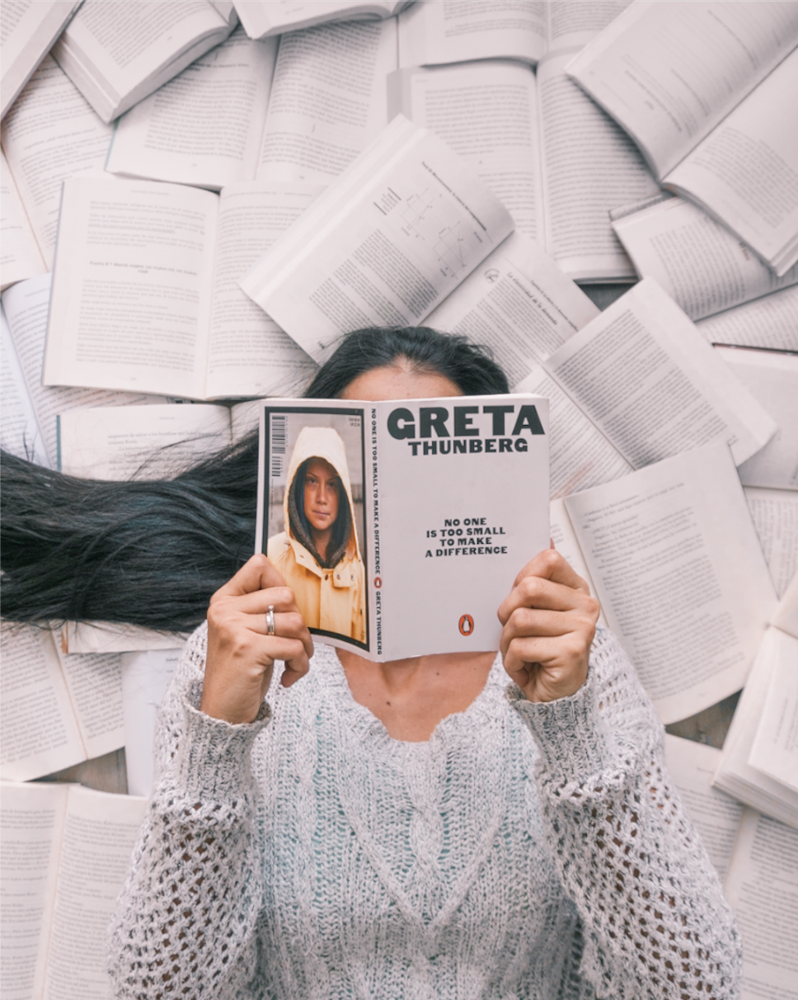

> *This post is part of an ongoing series in which I document my journey through the COVID-19 quarantine. See [Day 1](/quarantine-day-1) for full context.*

# Quick update

For sure I didn't want this day to be consumed by Netflix. I'd rather work on my hobbies or do something better with my time. I played guitar, practiced singing and even made some recordings in the morning. I later spent my afternoon photoshooting at home with wife and then practicing photo editing. I'm leaving a sample of what I shot today below.

Caught up on news today. Felt like it was the right choice. It seems like things are going pretty well as infected curves are already blending all over the world.

# Data Report

## Highlights

* **Avoid news**: No
* **Write blog**: Yes
* **Personal growth**: Yes. Kept reading Before you know it - John Bargh.
* **Wake up 5:00 am**: No
* **Workout**: No
* **Help someone**: No
* **Time wasted < 90 mins**: No

## Finances

* **Spent**: 3 USD
* **Stocks Portfolio (24h)**: 0% (weekend)
* **Stocks Portfolio (All time)**: +1.81%
* **Cryptofolio (24h)**: +3.22%
* **Cryptofolio (All time)**: +27.32%

Stay tuned.
