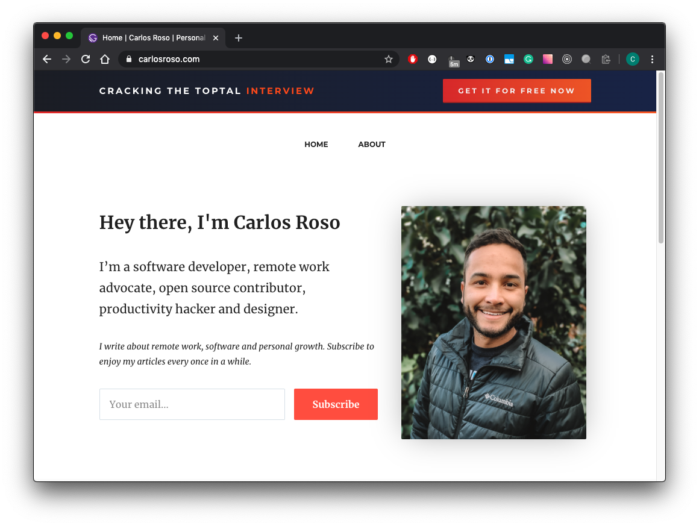

> *This post is part of an ongoing series in which I document my journey through the COVID-19 quarantine. See [Day 1](/quarantine-day-1) for full context.*

# Quick update

I felt the impact of not waking up early. I think I have mastered the habit of waking up at 5:00am but it's still difficult sometimes. Regardless, I can now feel the shame of not doing it. Waking up at 8:30am after sleeping like 10 hours feels so bad when I realize I couldn't use my morning productively. I know what I should do to improve this: **plan my day ahead since the day before**. This will allow my brain to be ready at 5:00am - ready to rock on that routine.

In other news, I added the banner on the header to attract traffic to my new guide Cracking the Toptal Interview. I also wrote on DEV.to, hope it brings on some leads. I'm ready now to start writing more meaningful content from now on as, again, *The secret to living is giving*.

# Data Report

## Highlights

* **Avoid news**: Yes
* **Write blog**: Yes
* **Personal growth**: Yes. Kept reading Before you know it - John Bargh.
* **Wake up 5:00 am**: No
* **Workout**: No
* **Help someone**: Yes
* **Time wasted < 90 mins**: Yes

## Finances

* **Spent**: 0 USD
* **Stocks Portfolio (24h)**: -0.46%
* **Stocks Portfolio (All time)**: +4.59%
* **Cryptofolio (24h)**: +1.03%
* **Cryptofolio (All time)**: +59.64%

Stay tuned.
