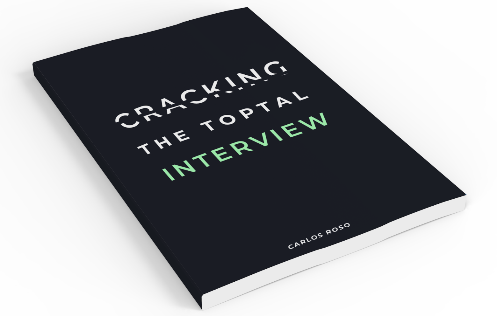

> *This post is part of an ongoing series in which I document my journey through the COVID-19 quarantine. See [Day 1](/quarantine-day-1) for full context.*

# Quick update

I love how I was able to spend the whole day writing blog posts. It's still a difficult task for me. I like doing it but sometimes the words just won't come out as easy. The amount of focus I was able to put was good with 3 blocks of deep work. 
Let's see what I wrote today:

- **[This is what I did to ace the Toptal interview](/this-is-what-i-did-to-ace-the-toptal-interview)**: Here I talk about the things I think are relevant to pass the technical interview at Toptal.
- **[Pimp your bash_profile with these 3 simple tricks](/pimp-your-bash-profile-with-these-3-simple-tricks)**: I talk about bash aliases and functions. This is a basic topic but it's something I recently learned, so it's something I feel obliged to teach.

Oh, and we got a brand new cover for Cracking the Toptal Interview 😏.

# Data Report

## Highlights

* **Avoid news**: Yes
* **Write blog**: Yes
* **Personal growth**: Yes. Kept reading Before you know it - John Bargh.
* **Wake up 5:00 am**: Yes
* **Workout**: No
* **Help someone**: Yes
* **Time wasted < 90 mins**: Yes

## Finances

* **Spent**: 25 USD
* **Stocks Portfolio (24h)**: +1.68%
* **Stocks Portfolio (All time)**: +6.34%
* **Cryptofolio (24h)**: +4.08%
* **Cryptofolio (All time)**: +66.15%

Stay tuned.
