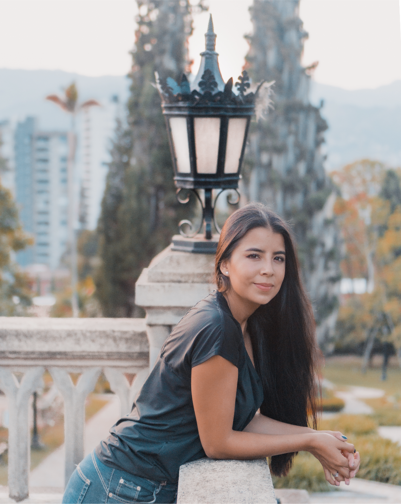
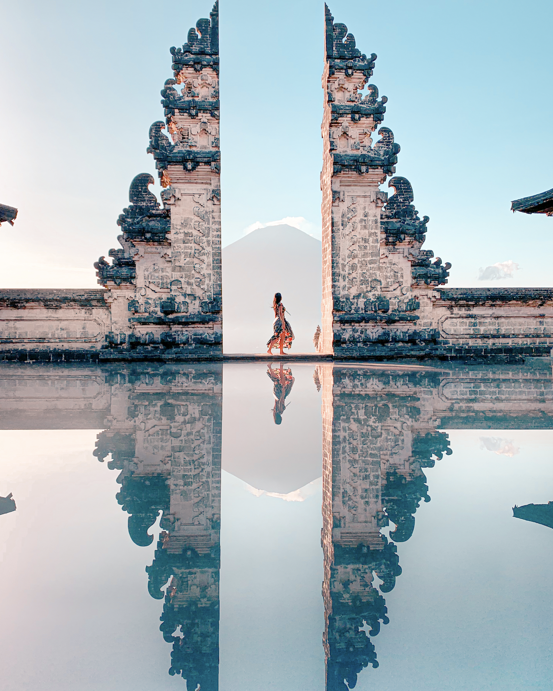
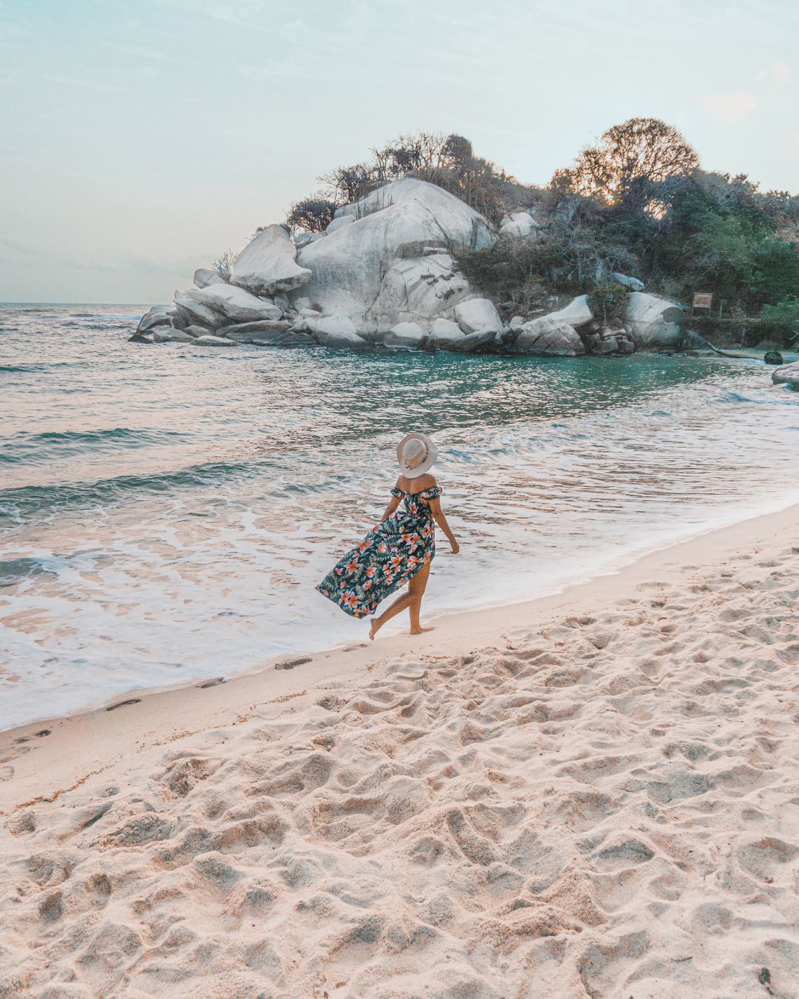

> *This post is part of an ongoing series in which I document my journey through the COVID-19 quarantine. See [Day 1](/quarantine-day-1) for full context.*

# Quick update

Oh weekends. Time for family and hobbies. On weekends I stress less about productivity and but I do strive for good time allocation. Today I shared a lot of time with wife and also worked on one of my hobbies: photography. I realized I should take a more pragmatic approach when it comes to editing.

I spent the whole day editing pictures so thy all follow a common color pattern. These are some results:

Side note: Been 3 weeks now in quarantine and it doesn't really feel bad. I'm spending my days doing what I love. I don't like I'm spending too much on the phone, though. I feel like I distractions should not eat my time that vastly.

# Data Report

## Highlights

* **Avoid news**: Yes
* **Write blog**: No
* **Personal growth**: No
* **Wake up 5:00 am**: No
* **Workout**: No
* **Help someone**: Yes
* **Time wasted < 90 mins**: Yes

## Finances

* **Spent**: 0 USD
* **Stocks Portfolio (24h)**: 0% (weekend)
* **Stocks Portfolio (All time)**: +7.93%
* **Cryptofolio (24h)**: +1.5%
* **Cryptofolio (All time)**: +47.82%

Stay tuned.
