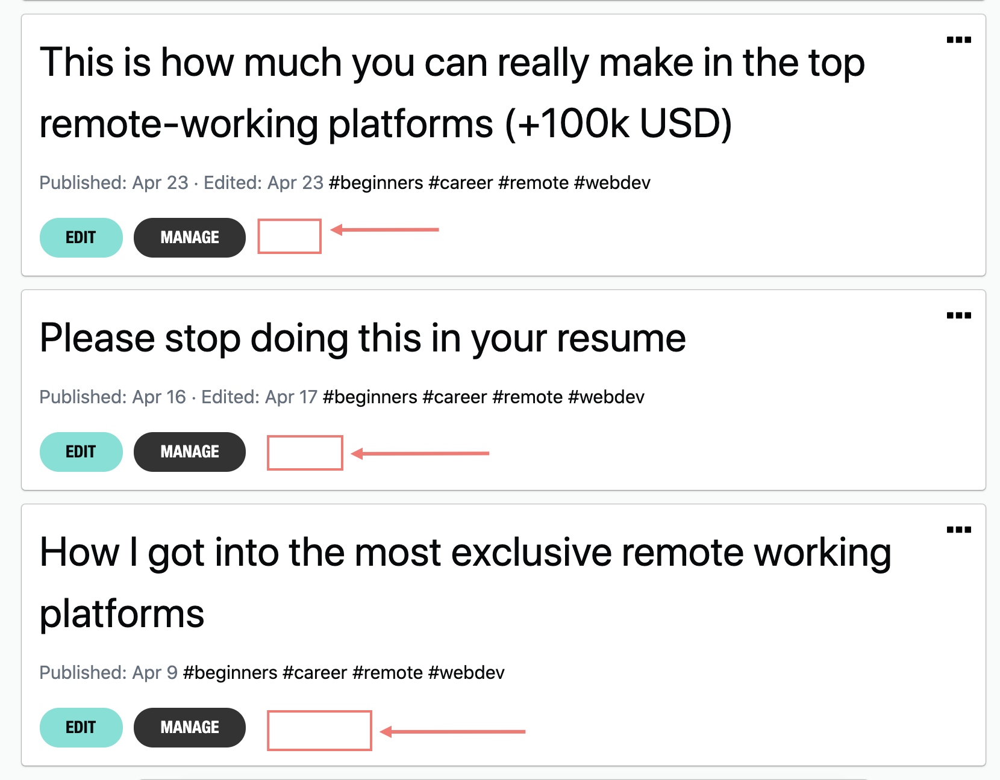
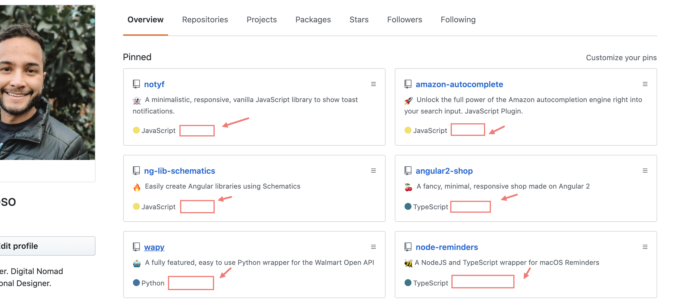
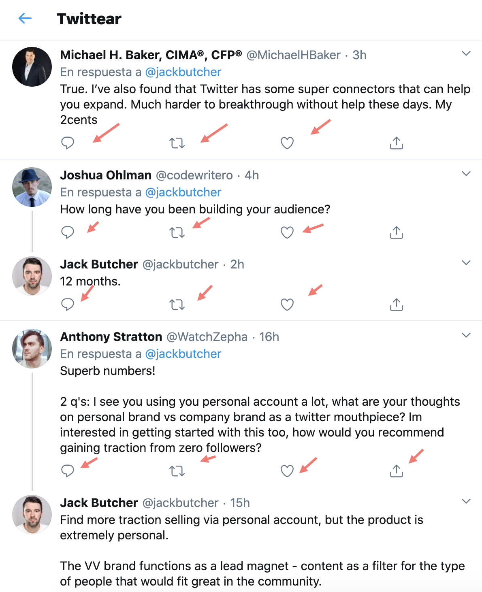
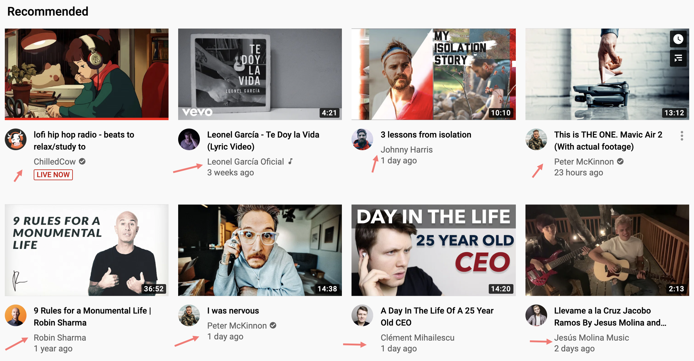

> *This post is part of an ongoing series in which I document my journey through the COVID-19 quarantine. See [Day 1](/quarantine-day-1) for full context.*

# Quick update

Woke up 4:30am, 20 mins before the alarm should've rang. Had a lot of thoughs in my mind, it was the unconcious trying to tell me something. I know it was that. I'd given my mind some homework before sleep, put a lot of thoughts and it all was transformed into rush and anxiety. You know what I was thinking about? how well my post did, how many followers I grew, etc. I'm just full of vanity and it doesn't feel good.

I recognized this as an oppotunity and I did something about it. I created a Chrome extension to hide all the metrics from everywhere. This applies to both me as a consumer and as a producer. I will not want to be biased to like or favorite something just for social proof. My critical thinking is being affected. I can barely decide if I like something, or I just follow the herd. Also, as a producer, I'm geniunely creating content to help and make people grow, but I feel so rushed for approval, applause or recognition.

So this is what I'll do **for 1 year straigth**. I'll hide all numbers from Twitter, DEV,  LinkedIn, Medium, Youtube and Github. Wait but, Github too? Yeah, same principle. Stars are just disguised likes. I have projects with a lot of stars that no one uses, it's only useful to show off. I've seen projects with 50 stars and 100k installs. Github stars are not a measure of how useful a package is but rather how well they appealed to your audience.

This what the web looks like for me now (no likes, no notifications, no followers, no views):

# Data Report

## Highlights

* **Avoid news**: Yes
* **Write blog**: No
* **Personal growth**: Yes
* **Wake up 5:00 am**: Yes
* **Workout**: No
* **Help someone**: Yes
* **Time wasted < 90 mins**: Yes

## Finances

* **Spent**: 30 USD
* **Stocks Portfolio (24h)**: +1.02%
* **Stocks Portfolio (All time)**: +11.58%
* **Cryptofolio (24h)**: +0.79%
* **Cryptofolio (All time)**: +65.03%%

Stay tuned.
