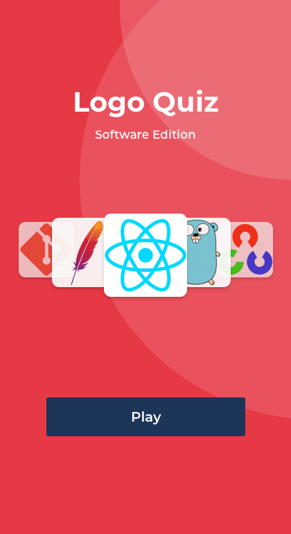
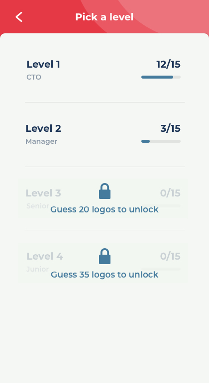
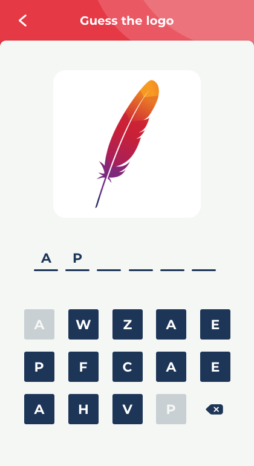

> *This post is part of an ongoing series in which I document my journey through the COVID-19 quarantine. See [Day 1](/quarantine/quarantine-day-1) for full context.*

# Quick update

Wrote open source all day. I finished working on the design for logo quiz. Opened a new PR for PR memes too. Also tweeted a few things.

Here's what logo quiz is supposed to look like in the future.

# Data Report

## Highlights

* **Avoid news**: Yes
* **Write blog**: Yes
* **Personal growth**: Yes
* **Wake up 5:00 am**: No
* **Workout**: No
* **Help someone**: Yes
* **Time wasted < 90 mins**: Yes

## Finances

* **Spent**: 37 USD
* **Stocks Portfolio (24h)**: -0.05%
* **Stocks Portfolio (All time)**: +13.49%
* **Cryptofolio (24h)**: -3.58%
* **Cryptofolio (All time)**: +101.54%

Stay tuned.
