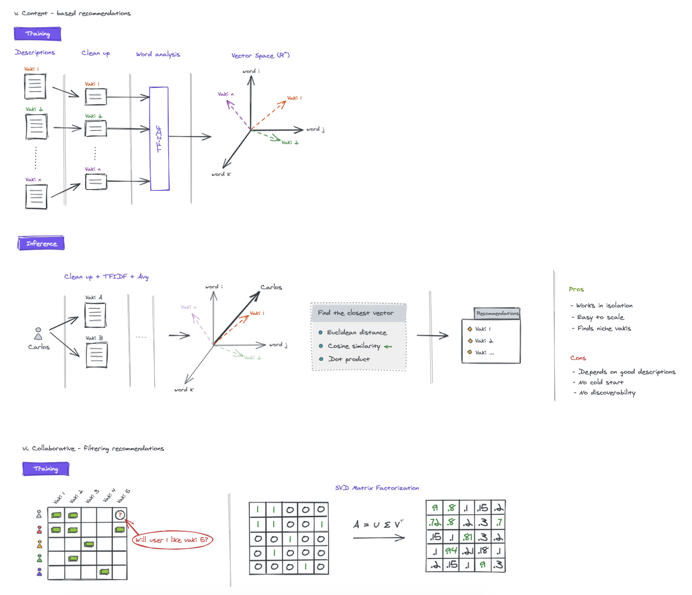

> *This post is part of an ongoing series in which I document my journey through the COVID-19 quarantine. See [Day 1](/quarantine/quarantine-day-1) for full context.*

# Quick update

Woke up 5:00 am, went back to sleep at 6am, and woke up 8am. This is relevant as I still put up the time to meditate even after waking up late. It makes me realize it's never too late in the day to meditate. I spent the rest of the day preparing a presentation for my work in Machine Learning for Vaki. It's ready to go:

I started to listen to Cal Newport's podcast lately and it's been amazing. Huge inspiration for having a Deep Life. So much time, brain and potential wasted on non-sense distractions that have kept me from using my full potential!
