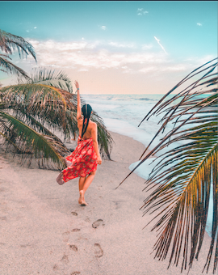
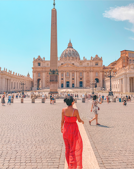

> *This post is part of an ongoing series in which I document my journey through the COVID-19 quarantine. See [Day 1](/quarantine/quarantine-day-1) for full context.*

# Quick update

Spent the whole day editing photos. I'm still not 100% happy with the results. Mastering this skill will take a lot of time and practice. Here are some of the results:

# Data Report

## Highlights

* **Avoid news**: Yes
* **Write blog**: No
* **Personal growth**: Yes
* **Wake up 5:00 am**: No
* **Workout**: No
* **Help someone**: No
* **Time wasted < 90 mins**: No

## Finances

* **Spent**: 11 USD
* **Stocks Portfolio (24h)**: 0% (weekend)
* **Stocks Portfolio (All time)**: +11.97%
* **Cryptofolio (24h)**: -1.74%
* **Cryptofolio (All time)**: +58.46%

Stay tuned.
