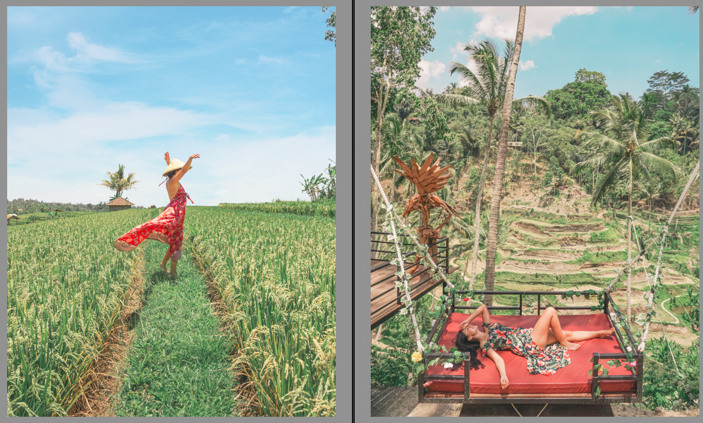

> *This post is part of an ongoing series in which I document my journey through the COVID-19 quarantine. See [Day 1](/quarantine/quarantine-day-1) for full context.*

# Quick update

Photo-editing saturday, as usual. I feel I'm getting better and better at it. My wife is also getting good comments and growing her follower base, which feels nice as I think I'm part of her success, at least a very small part of it. She's the best.

# Data Report

## Highlights

* **Avoid news**: Yes
* **Write blog**: Yes
* **Personal growth**: Yes
* **Wake up 5:00 am**: Yes
* **Workout**: No
* **Help someone**: No
* **Time wasted < 90 mins**: No

## Finances

* **Spent**: 80 USD
* **Stocks Portfolio (24h)**: -2.14%
* **Stocks Portfolio (All time)**: +11.57%
* **Cryptofolio (24h)**: -0.45%
* **Cryptofolio (All time)**: +97.10%

Stay tuned.
