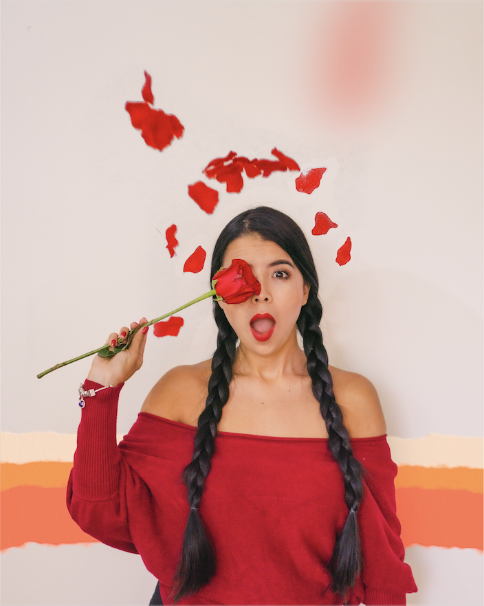

> *This post is part of an ongoing series in which I document my journey through the COVID-19 quarantine. See [Day 1](/quarantine/quarantine-day-1) for full context.*

# Quick update

As usual, I spent most of the day editing photos for wife. I love this plan and I feel I'm improving a lot lately. Try some new PSD magic this time.

Also, my brother just turned 24th today. Love this dude, happy birthday to you broda!

# Data Report

## Highlights

* **Avoid news**: Yes
* **Write blog**: No
* **Personal growth**: Yes
* **Wake up 5:00 am**: Yes
* **Workout**: No
* **Help someone**: No
* **Time wasted < 90 mins**: Yes

## Finances

* **Spent**: 33 USD
* **Stocks Portfolio (24h)**: +0%
* **Stocks Portfolio (All time)**: +14.34%
* **Cryptofolio (24h)**: -1.12%
* **Cryptofolio (All time)**: +90.09%

Stay tuned.
