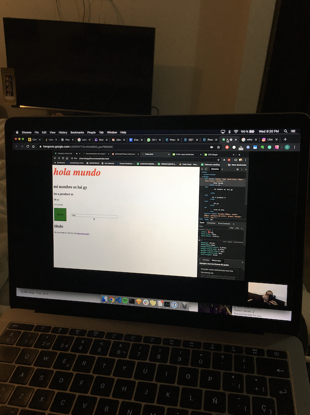

> *This post is part of an ongoing series in which I document my journey through the COVID-19 quarantine. See [Day 1](/quarantine/quarantine-day-1) for full context.*

# Quick update

I'm writing this log on Jun 12 and it's very concerning I can't recall what this day was all about. It's really like a blank day. Only thing I can remember is having the first lesson with my brother to start learning code.

Two things I get from this:

1. Even on vacations, every day matters, so I should make it count. Set a goal to make it count.
2. Do your best to journal that day. Some times it's not so much about doing nothing, but instead about forgetting it. My memory is flawed and journaling helps making each day count.
