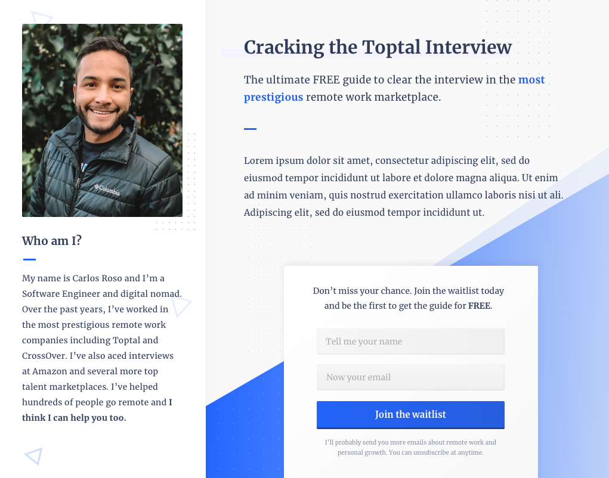
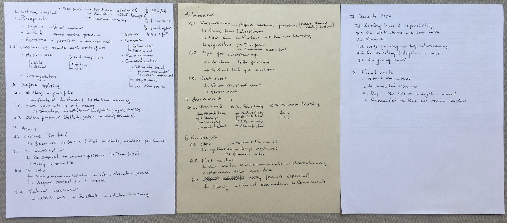

> *Public draft: [Google Doc](https://docs.google.com/document/d/1caLcOkSg4Bti1YHWL6QDjmpHfyd6bFsQa83WGWKzS84/edit#heading=h.w1mlzdqdn8sc)*

## Mon Apr 6

I published the landing page to give away the Cracking the Toptal Interview guide. It's live here: https://carlosroso.com/cracking-the-toptal-interview/. With this I intend to share my knowledge and help people, while attracting subscribers to convert them later into a paid service.

## Sun Apr 5

No progress

## Sat Apr 4

Designed the landing page waitlist where I'll gather emails to send the guide later on.

## Fri Apr 3

I analyzed all the messages with my brother and came up with an strategy to increase my impact and help people. I decided I'll create a guide called Cracking the Toptal Interview as the first step to writing the book. This will give me a good foundation for my book.

## Thu Apr 2

Gathered the most relevant comments people have made on my Medium post about remote work. I think this will give me the right starting point to write the appropriate book, moving forward. I can already recognize patterns. I want to write some follow up articles to get more people engaged and link them to my site, where I can capture more info. Just a rough initial idea. In the meanwhile, I'll keep making progress on the book.

## Wed Apr 1

No tangible progress was made today. Been drafting some ideas on how to better communicate the purpose of the book. I'm thinking I should employ a more progressive strategy rather than writing a full blown book that no one actually finds it helpful in the end. Still running through ideas.

## Tue Mar 31

Finished writing the introduction. This will take a lot more than I initially expected. I have no rush, though, I'm focused on the process for now, not the end result.

## Mon Mar 30

Started writing the draft in this [Google Doc](https://docs.google.com/document/d/1caLcOkSg4Bti1YHWL6QDjmpHfyd6bFsQa83WGWKzS84/edit#heading=h.w1mlzdqdn8sc). Wrote some paragraphs for the introduction.

Finding the right words for the right paragraph feels harder than I initially expected. Big learning journey ahead, for real.

## Sun Mar 29

Kickoff.

I'm officially writing a book. Don't know the name yet. I'll sum up all of what I know about remote work in this book.

**Why do I want to write this book?**
1. Help fellow devs get to where I have come to be today.
2. Teach all what I've learned about remote work.
3. Generate a passive income on the long term.

This is a first rough sketch of what I envision for my book.

Right off the bat, I plan this book to help tech workers go remote. I'll focus first in Frontend, Backend and Machine Learning developers as that's what I'm familiar with. I'll look for experts and extend the book with Product Management, Finance, etc.
