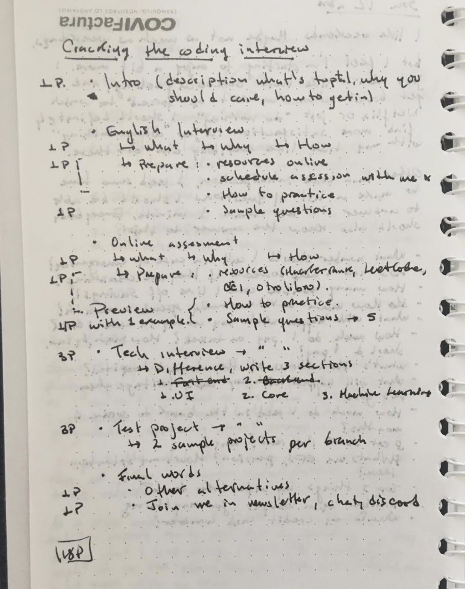

> *Public draft: [Google Doc](https://docs.google.com/document/d/1caLcOkSg4Bti1YHWL6QDjmpHfyd6bFsQa83WGWKzS84/edit#heading=h.w1mlzdqdn8sc)*

## Mon Jun 1

Last week I had what I call a *mental breakdown*. I focused on doing so much these months that I barely took time to reflect and it took a toll on me. I'm taking a few weeks off to rethink my priorities. Stay tuned.

## Mon May 18

Awesome milestone. I finally finished the Cracking the Toptal Interview guide! So proud to have been able to pull this off. I first thought about this on Apr 3 so it took me like 6 weeks to complete. It's definitely much more than I initially expected but it was totally worth it. What I thought was going to be 15 pages initially turned out to be 50. I really hope this helps a lot of people.

I now have a new idea. I'll write a paid mini-course with learnings for BigO complexity and algorithms. I want to bring this topic closer to devs who are not familiar with this topic in a very friendly way.

## Mon May 11

Small update on the intro.

## Tue May 5 - Sun May 10

Good progress on the guide. I'm almost 90% done. Will finish writing soon and then I'll start working on graphic design.

## Mon May 4

Wrote a small update with a new algorithm. Still WIP.

## Wed Apr 29

Launched [v1.0](https://mailchi.mp/155dcad64aca/career-boosthow-to-join-the-toptal-elite-4823430) of CTTI in the newsletter. Also wrote another coding example.

## Tue Apr 28

No progress

## Mon Apr 27

Did a lot of good progress on the Online Coding Assessment. Wrote two problems with solutions and many more resources

## Sun Apr 26

No progress

## Sat Apr 25

No progress

## Fri Apr 24

Lots of good progress on the [coding assessment](/ctti-draft) section of the guide.

## Wed Apr 22

Wrote article in [DEV](https://dev.to/caroso1222/this-is-how-much-you-can-really-make-in-the-top-remote-working-platforms-100k-32og). Got a few more subs.

## Tue Apr 21

No progress

## Mon Apr 20

Finally started writing the CTTI guide. I wrote almost all the English Interview section today. Progress [here](/ctti-draft). Also, we just crossed **135 subscribers** in the newsletter. I'll send the newsletter tomorrow.

## Sun Apr 19

No progress

## Sat Apr 18

No progress

## Fri Apr 17

Wrote my first newsletter EVER. It's done but it's scheduled to launch next monday. Also, finally achieved **100 subscribers** in my newsletter! Time to move fast and ship. My next goal is not to get +100 more but, instead, to ship the Cracking the Toptal Interview guide.

## Thu Apr 16

I published a new blog post to [Dev.to](https://dev.to/caroso1222/please-stop-doing-this-in-your-resume-2mga) which landed me 20 more subscribers. Not bad. I need to keep consistency. I also wrote a plan to start sending out my newsletter early next week. It will have the first draft of the Cracking the Toptal Interview guide.

## Wed Apr 15

Wrote a rough sketch on what the first entry will look like. I mean like writing specific paragraphs with information for the first newsletter. I'm sooo slowly getting there.

## Tue Apr 14

No progress

## Mon Apr 13

Finally built a sketch on how Cracking the Toptal Interview will ultimately look like. I got short of 70 people subscribed to the newsletter, so I'm almost ready to send the first draft.

## Sun Apr 12

Wrote a few ideas on paper, nothing much, but better than no progress.

## Sat Apr 11

No progress

## Fri Apr 10

No progress

## Thu Apr 9

Published my post on [dev.to](https://dev.to/caroso1222/how-i-got-into-the-most-exclusive-remote-working-platforms-45dk) and got 50 people signed up for the free guide. Not bad for a day, in my view. Also wrote a Medium draft and got it peer-reviewed already, I'll work on it today and will publish next week on "The Startup" (biggest Medium publication).

I'm thinking the landing page of Cracking the Toptal Interview truly needs an update. I need to write at least one page to get more people engaged - time to start making real progress on the guide.

## Wed Apr 8

Wrote a new blog post with more details on how to get into Toptal, it's here: [This is what I did to ace the Toptal interview](/this-is-what-i-did-to-ace-the-toptal-interview). I'll post it tomorrow at prime time (12PST) and hopefully get some more leads. 

Got a new cover for the guide!

## Tue Apr 7

I created the book cover and added the banner on every page of my site. I have an appealing way to capture traffic - now I'll need to start writing content. I also wrote the same Medium article in DEV.to which I expect can get me a few more leads.

## Mon Apr 6

I published the landing page to give away the Cracking the Toptal Interview guide. It's live here: https://carlosroso.com/cracking-the-toptal-interview/. With this I intend to share my knowledge and help people, while attracting subscribers to convert them later into a paid service.

## Sun Apr 5

No progress

## Sat Apr 4

Designed the landing page waitlist where I'll gather emails to send the guide later on.

## Fri Apr 3

I analyzed all the messages with my brother and came up with an strategy to increase my impact and help people. I decided I'll create a guide called Cracking the Toptal Interview as the first step to writing the book. This will give me a good foundation for my book.

## Thu Apr 2

Gathered the most relevant comments people have made on my Medium post about remote work. I think this will give me the right starting point to write the appropriate book, moving forward. I can already recognize patterns. I want to write some follow up articles to get more people engaged and link them to my site, where I can capture more info. Just a rough initial idea. In the meanwhile, I'll keep making progress on the book.

## Wed Apr 1

No tangible progress was made today. Been drafting some ideas on how to better communicate the purpose of the book. I'm thinking I should employ a more progressive strategy rather than writing a full blown book that no one actually finds it helpful in the end. Still running through ideas.

## Tue Mar 31

Finished writing the introduction. This will take a lot more than I initially expected. I have no rush, though, I'm focused on the process for now, not the end result.

## Mon Mar 30

Started writing the draft in this [Google Doc](https://docs.google.com/document/d/1caLcOkSg4Bti1YHWL6QDjmpHfyd6bFsQa83WGWKzS84/edit#heading=h.w1mlzdqdn8sc). Wrote some paragraphs for the introduction.

Finding the right words for the right paragraph feels harder than I initially expected. Big learning journey ahead, for real.

## Sun Mar 29

Kickoff.

I'm officially writing a book. Don't know the name yet. I'll sum up all of what I know about remote work in this book.

**Why do I want to write this book?**
1. Help fellow devs get to where I have come to be today.
2. Teach all what I've learned about remote work.
3. Generate a passive income on the long term.

This is a first rough sketch of what I envision for my book.

Right off the bat, I plan this book to help tech workers go remote. I'll focus first in Frontend, Backend and Machine Learning developers as that's what I'm familiar with. I'll look for experts and extend the book with Product Management, Finance, etc.
