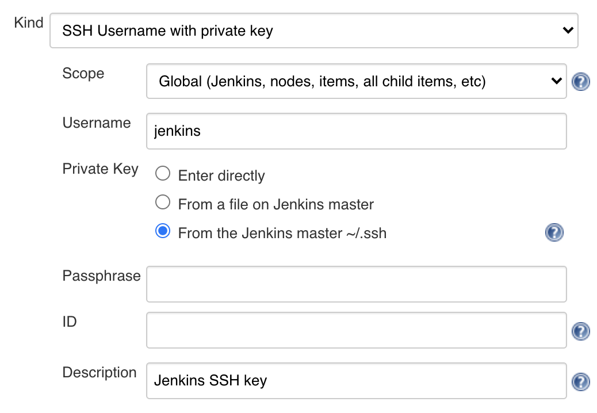

I recently enabled 2FA in my [Github account](https://github.com/caroso1222) which caused Jenkins to stop [deploying my personal apps](../deploying-frontend-applications-the-fun-way/). This was expected because I was authenticating with plain credentials from Jenkins. Here's how I changed my pipelines to authenticate with SSH keys instead.

1. Get your server's default SSH public key. In my case, Jenkins runs under the `jenkins` user.
```
$ su - jenkins
$ cat ~/.ssh/id_rsa.pub
```
Copy the content in your clipboard.

2. Go to your Github account. Visit ["SSH and GPG keys"](https://github.com/settings/keys).
3. Click on "New SSH key". Set **Title** to *Jenkins SSH*. Paste your key in the **Key** textarea.
4. Now go to your Jenkins and visit "Credentials".
5. Click the "(global)" link.
6. Click on "Add Credentials".
7. Use the following values for each field:
    * **Kind:** SSH Username with private key
    * **Scope:** Global (Jenkins, nodes, items, all child items, etc)
    * **Username:** jenkins
    * **Private key:** From the Jenkins master ~/.ssh
    * **Description:** Jenkins SSH key
  


8. Hit "OK" and go back.
9. Grab the ID of the recently created credentials.
10. Use the new ID in your pipeline script. Here's what my script looks like. Notice how I use the new credential's ID in the property **credentialsId**:

```groovy{numberLines: true}
#!/usr/bin/env groovy

node {
  def app

  stage("Clone") {
    git branch: 'master',
    credentialsId: '13171411-1a23-5e67-a8e9-f11e22221ec7',
    url: 'git@github.com:caroso1222/carlos-roso-gatsby.git'
  }

  stage("Build") {
    app = docker.build("caroso1222/carlos-roso-gatsby")
  }

  stage("Deploy") {
    ...
  }
}
```

There you have it. You're good to build your pipelines in a real secure way.
