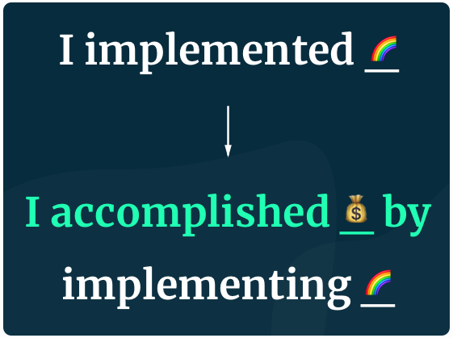
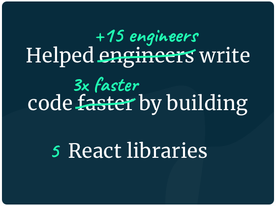

Say you're a recruiter and you're reading the "Work experience" section of a candidate's resume.

Which of the following bullets sounds like a more impressive statement for you?

1. Spent dozens of hours writing blog posts about Go and Kubernetes.
2. Reached +20k visits (aggregate reading time +100 hours) in technical posts on Go and Kubernetes.

What about this one?

1. Created presentations based on data for company stakeholders.
2. Helped stakeholders take decisions worth +50k USD by analyzing big data (+2000GB) and building reports in PowerBI.

I personally find alternative #2 to be more engaging and interesting. As a recruiter, I will easily remember the girl with experience mangling +2TB of data or the dude with a ton of views on his blog. **But, why does it work?**

*Note: if you still think there's no difference, that's fine. This is just an oppinionated approach that has worked for me (see section below).*

# Stick to these 2 rules

Having a [strong resume](https://dev.to/caroso1222/please-stop-doing-this-in-your-resume-2mga) helped me land interviews at Amazon, [Toptal](https://www.toptal.com/#join-only-great-devs), Crossover and many more [top remote work platforms](https://carlosroso.com/how-i-got-into-the-most-exclusive-remote-working-platforms/). I credit most of my CV success to the way I showcase my work experience. Let's see how it works.

The trick here is to follow 2 simple rules:

1. Use the format **"Accomplished X by implementing Y"**.
2. Show numbers.

*Note: Credits goes to [Gayle L. McDowell](https://twitter.com/gayle) as I took inspiration from her book [Cracking the Coding Interview](http://www.crackingthecodinginterview.com/).*

## 1. Show your accomplishments

If you find it hard to remember two rules, then stick to this one: **don't tell me what you did, tell me what you accomplished**.

Writing Angular apps, PHP backends or wiring Firebase APIs are very common things in our industry. Every devs goes through that eventually. It's not what you did but rather what you achieved, what really sets you apart from the crowd. 

## 2. Show numbers

If a bullet in you work experience was a title for a blog post, would you read it? When you think about it that way, you realize how important numbers are. The use of numbers [has proven to be highly effective](https://problogger.com/use-numbers-effectively/) when engaging with your audience; your audience just happens to be your recruiter.

If you don't have numbers to show on your resume you're not thinking deep enough. Remember that time when you integrated OAuth in your app? Can you recall any conversion increase? Use that number here. Did you create an architecture guide for React apps in your company? how much discussions do you think that document helped reduce? I'd say more than 3x. Use that metric in this section.

If you definitely don't have any metric, then start measuring today! Coding is just a means to an end, and that end can surely be measured.

# Examples

I *partnered* with my friend and Google Dev Expert, [Juan](https://twitter.com/jdjuan), to review resumes from the community. After reviewing several of these and giving a lot of advice, I gathered a handful of examples that you can use as a guideline to improve your CV today.

https://twitter.com/caroso1222/status/1248958395819921408

Keep in mind these are real life examples for real life devs.

## Frontend Dev

- Helped +20 customers evaluate ideas in record time by building fast UI prototypes in Angular. This resulted in a time-to-market reduction of 400%.
- Improved loading time in 5x by using advanced web performance techniques for Angular (tree shaking, lazy loading, custom webpack configuration).

## Backend Dev

- Reduced deploy time 70% by implementing a CI/CD Jenkins pipeline which helped product managers validate features 2x faster.
- Helped customers run through data 2x faster by implementing paginated API responses in RoR and JavaScript.

## Data Science

- Instrumented and optimized oil drilling operations by building data pipelines in SQL. This resulted in +20M USD savings from risk and fault prevention.
- Influenced multimillionare product decisions by analyzing data (+25GB) and presenting data reports.

## Tech lead

- Achieved 400% team growth as a lead of 8 backend and frontend engineers. I also contributed as the chief architect of the whole engagement.
- Lead a team of 3 developers and acted as the principal architect for the development of 5 mobile apps.

## Dev advocate

- Trained 300 students in 3 workshops of VHDL and C++ development.
- Instructed +300 undergrad students on topics such as advanced Business Analytics and Machine Learning.

I hope you got some inspiration and learned something new. Remember, when it comes to showing off work experience, **it's not so much about what you did, but about what you accomplished**.

If you liked this, you might want to get more advice on [what **not** to do in your resume](https://dev.to/caroso1222/please-stop-doing-this-in-your-resume-2mga). You can also ping me anytime on [Twitter](https://twitter.com/caroso1222), I can take a look at your resume and give feedback (if I'm not super busy at the time).

Let me know in the comments, what other strategies do you use to show your work experience? what has or hasn't worked so far?
