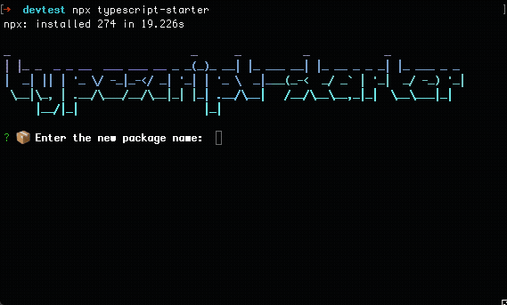

The secret to being prolific at something is to automate mundane tasks as much as possible. For software, this can translated as using CLIs, starters or boilerplates to get you up and running in no time. Let's see how to quickly set up a Typescript library with unit testing, automatic release, continous integration, and documentation.

<div class="divider"></div>

For didactic purposes, we'll create a useless library that exposes a method to count the words in a sentence.

1. We'll use the [typescript-starter](https://github.com/bitjson/typescript-starter) CLI to get us up and running. Execute this in the terminal:

```
$ npx typescript-starter
```

It'll make you run through a series of questions.



2. Remove the contents from `src/lib` and create a file for your library.

```
$ rm -rf src/lib/* && touch src/lib/tswordcount.ts
```

3. Edit `index.ts` to configure your public API.

```typescript
export * from './lib/tswordcount';
```

4. Write your function in the file created in step 2. Our file is `tswordcount.ts`.

```typescript
export function countWords(sentence: string): number {
  return sentence.split(/\s+/).length;
}
```

*Note: Notice we're not doing `.split(' ')` as this would fail at inputs with long spaces in between the words. We use regex to separate words regardless of the spaces that divide them.*

<div class="divider"></div>

# Gotchas

You might face some problems right from the start because the project hasn't been maintained for a few months now. Follow the next steps to fix them.

1. Install the latest version of AVA

```
$ npm i ava@latest
```

2. Remove the following lines from `package.json` to make AVA work properly

```diff
"ava": {
    "failFast": true,
    "files": [
      "build/main/**/*.spec.js"
-    ],
-    "sources": [
-      "build/main/**/*.js"
    ]
  },
```

3. Update `typedoc` dependencies:

```
$ npm un @bitjson/typedoc && npm i -D typedoc
```

4. Optional. If using [Travis CI](https://travis-ci.org/), make sure you enforce coverage in your build. Change your `.travis.yml` with this:

```yaml
sudo: false
language: node_js
node_js:
  - '10'
cache:
  directories:
    - '$HOME/.npm'
script:
  - npm run test
  - npm run cov:send
  - npm run cov:check
```
