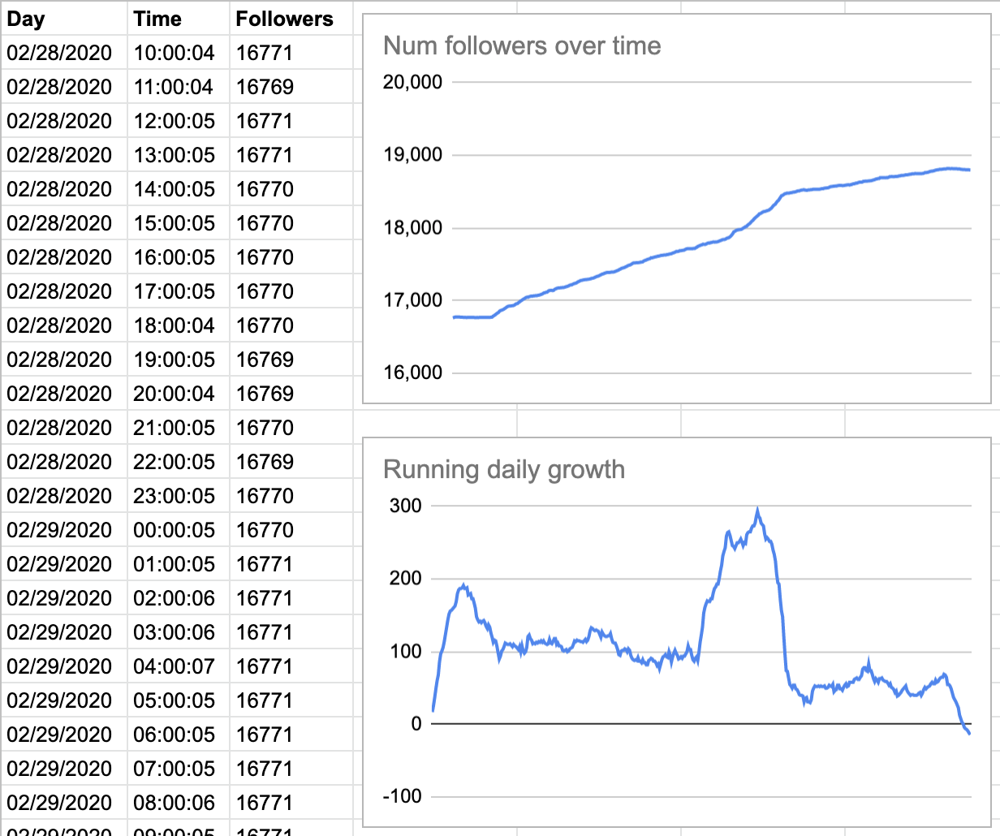

# Why?

My wife creates [travel content on Instagram](https://www.instagram.com/linaestadeviaje/). She's the type of person that, like me, tracks every possible piece of data. **"_What you don't measure, you can't improve_"**, they said. She wanted to track her follower base growth but most online services won't offer much of this for free or with the flexibility she wanted.

She set an alarm every day at 10:00am to register the number of followers in a spreadsheet. This turns out to be very inconvenient for a full-time traveler. Most places have poor data coverage and your daily routine is unpredictable.

Repetitive tasks are green flags for automation. Given my [NIH](https://en.wikipedia.org/wiki/Not_invented_here) obsession, I needed to solve this in the most overkill possible way.

# Problem

We need a way to periodically capture the number of followers of an Instagram account. Then, we need to register it in Google Sheets for further data analysis.

# Proposed solution

I found setting up the Instagram API to be somehow cumbersome for such a simple task (good signal for an open source project). I will then **scrap the Instagram profile's HTML, read the exact count and write it down on a Google Sheet** using the [API](https://developers.google.com/sheets/api). I will also need to run this periodically [from my server](https://medium.com/hackernoon/deploying-frontend-applications-the-fun-way-bc3f69e15331). Cron will get the job done.

I'll go with Python on this one because:
1. I've done web scrapping before with [BeautifulSoup](https://pypi.org/project/beautifulsoup4/)
2. The Google Sheets API has great Python support

# Implementation

## Installation

We'll use `BeautifulSoup` to scrap and the Google APIs to handle auth:

```bash
pip install --upgrade google-api-python-client google-auth-httplib2 google-auth-oauthlib beautifulsoup4
```

_Note: I recommend running your pip commands within a virtualenv._

## Read followers

Instagram registers a JavaScript object in the window (aka a global) with the number of followers in the prop `edge_followed_by`. We'll use a regex capture group to get that number and send it to Google Sheets.

```python{numberLines: true}
import requests
import json
from bs4 import BeautifulSoup

URL = 'https://www.instagram.com/linaestadeviaje/'
page = requests.get(URL)

soup = BeautifulSoup(page.content, 'html.parser')
followers = re.search('"edge_followed_by":{"count":(\d*)}', soup.prettify()).group(1)
```

## Write to Google Sheets

You'll need to create a private sheet and grab its ID from the URL. Create a new sheet and name it *Followers*.

This part is based on the quickstart section of the [Google Sheets Python API guide](https://developers.google.com/sheets/api/quickstart/python). It uses OAuth for the initial user consent and then it will store the auth information on the `./creds/token.pickle` file.

You'll also need to download your `credentials.json` file to complete the initial OAuth flow. Get yours by clicking on *"Enable the Google Sheets API"* in the [official API docs](https://developers.google.com/sheets/api/quickstart/python#step_1_turn_on_the).

## Put it all together

Here's what the final script looks like. The code has been *documented* for easy navigation. I've thrown everything into `main()` for simplicity, but I encourage you to write functions.

```python{numberLines: true}
import pickle
import os.path
from googleapiclient.discovery import build
from google_auth_oauthlib.flow import InstalledAppFlow
from google.auth.transport.requests import Request

import json
import requests
from bs4 import BeautifulSoup
from datetime import datetime

# If modifying these scopes, delete the file token.pickle.
# Note that this scope is for Read-Write permissions.
SCOPES = ['https://www.googleapis.com/auth/spreadsheets']

SPREADSHEET_ID = '###REPLACE WITH YOUR SHEET ID ###'
WRITE_RANGE_NAME = 'Followers!A2:C' # 'SheetName!Range'
CREDS_PATH = os.path.abspath('./creds/token.pickle')

def main():
    creds = None
    # The file token.pickle stores the user's access and refresh tokens, and is
    # created automatically when the authorization flow completes for the first
    # time.
    if os.path.exists(CREDS_PATH):
        with open(CREDS_PATH, 'rb') as token:
            creds = pickle.load(token)

    # If there are no (valid) credentials available, let the user log in.
    if not creds or not creds.valid:
        if creds and creds.expired and creds.refresh_token:
            creds.refresh(Request())
        else:
            flow = InstalledAppFlow.from_client_secrets_file('credentials.json', SCOPES)
            creds = flow.run_local_server(port=55680)
        # Save the credentials for the next run
        with open(CREDS_PATH, 'wb') as token:
            pickle.dump(creds, token)

    # Get the followers. You might probably want to move this to a function.
    URL = 'https://www.instagram.com/linaestadeviaje/'
    page = requests.get(URL)

    soup = BeautifulSoup(page.content, 'html.parser')
    followers = re.search('"edge_followed_by":{"count":(\d*)}', soup.prettify()).group(1)

    # A bit of sugar to get date and time
    now = datetime.now()
    date_string = now.strftime("%m/%d/%Y")
    time_string = now.strftime("%H:%M:%S")

    # Call the Sheets API
    service = build('sheets', 'v4', credentials=creds)
    sheet = service.spreadsheets()

    # Append a new row with the form [date, time, num_followers]
    sheet.values().append(spreadsheetId=SAMPLE_SPREADSHEET_ID,
                          range=WRITE_RANGE_NAME,
                          valueInputOption='RAW',
                          body={'values': [[date_string, time_string, followers]]}).execute()

if __name__ == '__main__':
    main()
```

## Dockerize all the things

You can leave now if you want. **Run the code above and you'll be good to go**. In the next few sections, I'll talk about how you can run this in a server.

I use a [combination of Docker and Digital Ocean](https://medium.com/hackernoon/deploying-frontend-applications-the-fun-way-bc3f69e15331) to deploy all my apps (this blog included). This means I need to dockerize all the apps before moving them to prod. This is fantastic, anyways, as I get to have full build processes in very different languages, all running on their own docker containers.

This is what the `Dockerfile` for this *app* looks like:

```Dockerfile{numberLines: true}
FROM python:3
RUN pip install --upgrade google-api-python-client google-auth-httplib2 google-auth-oauthlib beautifulsoup4
# Set timezone to register date/time appropriately
ENV TZ=America/Bogota
RUN ln -snf /usr/share/zoneinfo/$TZ /etc/localtime && echo $TZ > /etc/timezone
ADD main.py /
CMD [ "python", "./main.py" ]
```

**Important:** Make sure you don't commit your `token.pickle` file to GitHub or ship it within your Docker image. It should only be accessible in your prod environment. You will need to move this file from local to prod using your preferred method (e.g. ssh copy, private S3 bucket, temporary public link, etc).

## Run periodically

Much of the value for this comes from running the script periodically. You can achieve this using [cron](https://en.wikipedia.org/wiki/Cron) on a Unix server. As mentioned above, you want to keep my `token.pickle` out of the Docker image. You'll then need to mount a volume with the corresponding pointer to the pickle file.

This is what your crontab should look like if you want to run the routine every hour:

```bash
~ $ crontab -l
# run the IG followers fetching routine every hour
0 * * * * docker rm ig_followers && docker run -d --name=ig_followers -v /root/ig_followers/creds:/creds docker-hub-username/ig-followers:latest
```

_Bonus: Check out [this handy tool](https://crontab.guru/every-5-minutes) to create your cron schedule expressions._

## Results

Data is beautiful. Having it available in GSheets was the easy part; now it's up to you to make it count. You can plot your growth over time, running average of your daily growth, weekly change, etc.

Here you can see a spike in the daily growth (giveway posts and trending pics) and then it drops for a few weeks (COVID-19).



<div class="divider"></div>

# Final thoughts

Above all, enjoy and have fun. Don't get so obsessed with numbers, growth and plain metrics. **Get obsessed with helping, creating and inspiring.**

<div class="divider"></div>

# Legacy remarks

As of April 2020, Instagram changed the way to inject the number of followers. I'm leaving here the previous approach based on JSON-LD, just for future reference.

### Legacy (< April 2020)

As mentioned before, I decided to read the number of followers by doing basic web scrapping. I didn't want to bother setting up a Facebook account to use the Instagram API. It turns out Instagram uses [JSON-LD](https://developers.google.com/search/docs/guides/intro-structured-data) to _inject_ structured data into the page. This makes it easy to read the follower count:

```python{numberLines: true}
import requests
import json
from bs4 import BeautifulSoup

URL = 'https://www.instagram.com/linaestadeviaje/'
page = requests.get(URL)
soup = BeautifulSoup(page.content, 'html.parser')
data = json.loads(soup.find('script', type='application/ld+json').text)

followers = data['mainEntityofPage']['interactionStatistic']['userInteractionCount']
```
